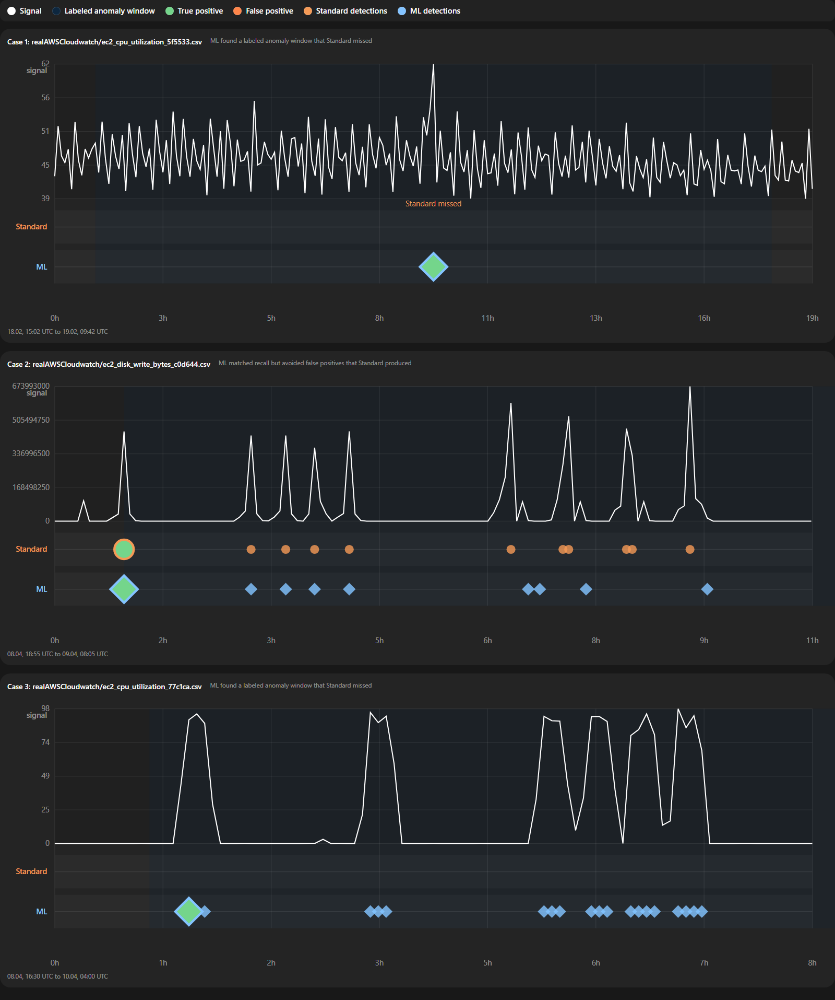

# ML Anomaly Alert Mode

## Summary

PR adds a new `ML` anomaly detection mode for SigNoz anomaly alerts alongside the existing `Standard` mode.

The goal is to keep the current z-score detector as a strong baseline and add a temporal ML detector that can get non trivial pattern deviations.

New option `ML` is available in the anomaly algorithm dropdown.

## Visual Comparison

Suggested screenshot slots for the PR:

1. Algorithm dropdown showing `Standard` vs `ML`
2. Case where `ML` detects a labeled anomaly that `Standard` misses
3. Case where `ML` reduces false positives on recurring bursty behavior

## Interactive comparison


[Open interactive chart](docs/interactive/ml-vs-standard-nab-multicase.html)

## Benchmark summary

The table below uses the common subset of NAB `realAWSCloudwatch` series where both `Standard` and the final `ML` detector can be compared directly.

`FP` means false-positive events: alert events raised outside labeled anomaly windows. Lower is better.

| Algorithm | Precision | Recall | Event F1 | FP events | Detected windows | Missed windows |
| --- | ---: | ---: | ---: | ---: | ---: | ---: |
| Standard | 0.0538 | 0.5000 | 0.0971 | 176 | 10 | 10 |
| ML | **0.2619** | **0.5500** | **0.3548** | **31** | **11** | **9** |

Source of the aggregate numbers:

```powershell
$env:NAB_ROOT='C:\Users\kacha\NAB'
go test ./ee/anomaly -run TestCompareTemporalLikeAcrossNABAWS -count=1 -v
```

These are common-coverage benchmark metrics. The three charts above are illustrative examples chosen from the same NAB AWS corpus.

### Metric definitions

- `Precision`: the share of raised anomaly events that were actually correct. Higher is better.
- `Recall`: the share of labeled anomaly windows that the detector successfully caught. Higher is better.
- `Event F1`: the harmonic mean of precision and recall. Higher is better.
- `FP events`: false-positive alert events raised outside labeled anomaly windows. Lower is better.
- `Detected windows`: the number of labeled anomaly windows that were hit by at least one detector event. Higher is better.
- `Missed windows`: the number of labeled anomaly windows that were not detected at all. Lower is better.

### Dataset

We evaluated the detector on the Numenta Anomaly Benchmark (NAB), using the `realAWSCloudwatch` subset:

- [Numenta Anomaly Benchmark (NAB)](https://github.com/numenta/NAB)

The three plots in this PR are representative examples from that same corpus.


## What Changed

### Backend

- Added a temporal ML anomaly provider in [ee/anomaly/ml_provider.go](./ee/anomaly/ml_provider.go).
- The provider wraps the existing anomaly provider and uses it as a fallback baseline during warmup.
- After warmup, the provider builds temporal feature vectors from recent series history and evaluates them with a rolling KMeans ensemble.
- Final anomaly decisions are based on model consensus rather than raw magnitude alone.

### Frontend

- Added `ML` to the anomaly algorithm enum in [frontend/src/container/CreateAlertV2/context/types.ts](./frontend/src/container/CreateAlertV2/context/types.ts).
- Added the `ML` option to the algorithm selector in [frontend/src/container/CreateAlertV2/context/constants.ts](./frontend/src/container/CreateAlertV2/context/constants.ts).

## Method

### Standard

The existing SigNoz anomaly score is z-score-like: it computes an expected value from seasonal context and measures deviation relative to standard deviation.

In practice:

- `Standard` is good at catching strong statistical outliers quickly.
- It can overfire on recurring burst patterns if they are large enough in magnitude.

### ML

The new `ML` mode works as a temporal detector:

1. During warmup it falls back to the base anomaly provider.
2. It builds temporal features from recent history.
3. It trains a rolling ensemble of temporal KMeans models over time windows.
4. A point is considered anomalous only when the ensemble consensus says it deviates from learned normal behavior.

This makes the detector more pattern-aware than magnitude-only thresholding.
<!-- 
## Why This Is Useful

The main product value is not “find bigger spikes”.

The value is:

- catch behavior that is unusual for this metric’s learned pattern,
- avoid flagging recurring bursts that are visually large but operationally normal,
- preserve the existing `Standard` mode for users who prefer simple statistical behavior. -->

## Files Changed

- [ee/anomaly/ml_provider.go](./ee/anomaly/ml_provider.go)
  Adds the temporal ML anomaly provider, warmup fallback behavior, temporal feature extraction, rolling model training, and consensus scoring.

- [ee/anomaly/ml_provider_test.go](./ee/anomaly/ml_provider_test.go)
  Covers provider behavior, warmup flow, temporal scoring, consensus decisions, and NAB-based regression checks.

- [frontend/src/container/CreateAlertV2/context/types.ts](./frontend/src/container/CreateAlertV2/context/types.ts)
  Adds the `ML` algorithm enum value.

- [frontend/src/container/CreateAlertV2/context/constants.ts](./frontend/src/container/CreateAlertV2/context/constants.ts)
  Adds the `ML` dropdown option in the anomaly alert creation flow.

## Dataset

We used the Numenta Anomaly Benchmark (NAB) real-world corpus, specifically the `realAWSCloudwatch` subset for system-metric-style evaluation.

Primary source:

- [Numenta Anomaly Benchmark (NAB)](https://github.com/numenta/NAB)

NAB describes itself as a benchmark for real-time anomaly detection on streaming time series and includes labeled real-world and synthetic datasets.

For the visual comparisons in this PR we focused on:

- `realAWSCloudwatch/ec2_cpu_utilization_5f5533.csv`
- `realAWSCloudwatch/ec2_disk_write_bytes_c0d644.csv`
- `realAWSCloudwatch/ec2_cpu_utilization_77c1ca.csv`

## Reproduction

### Use the feature in UI

1. Open SigNoz.
2. Go to `Alerts`.
3. Create a new anomaly alert.
4. Select a metric query.
5. In the anomaly algorithm selector, choose either:
   - `Standard`
   - `ML`
6. Compare alert behavior on the same metric and time range.
