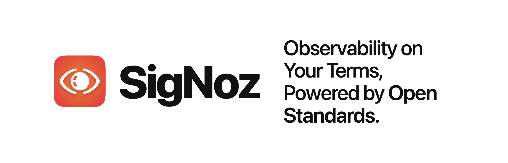
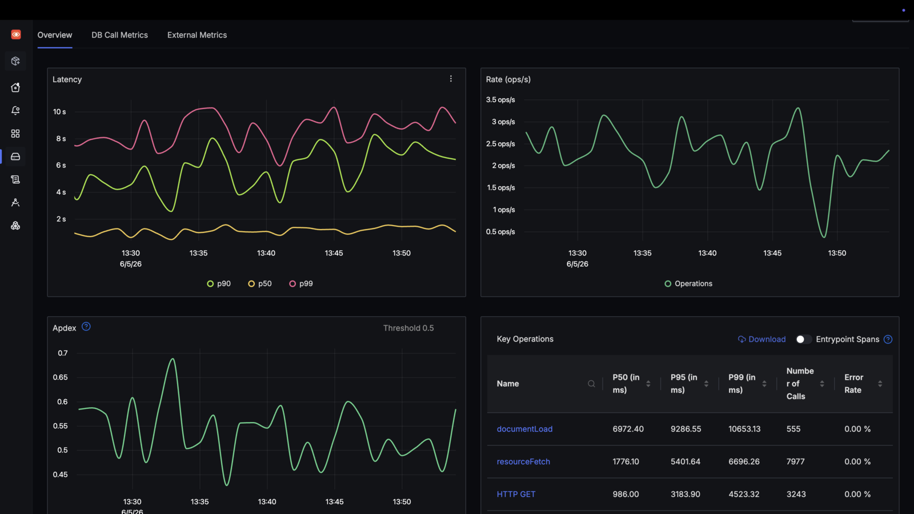
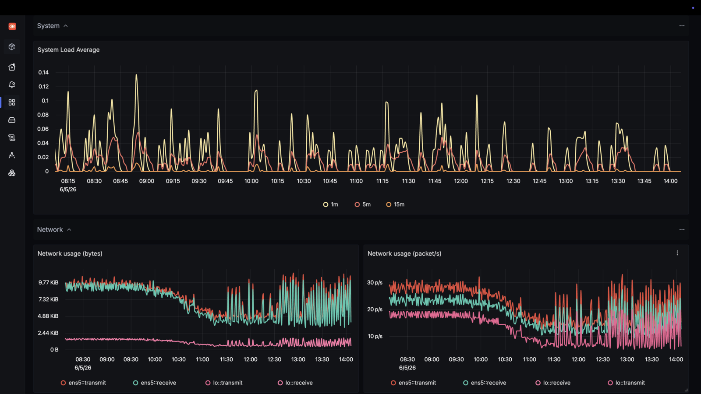
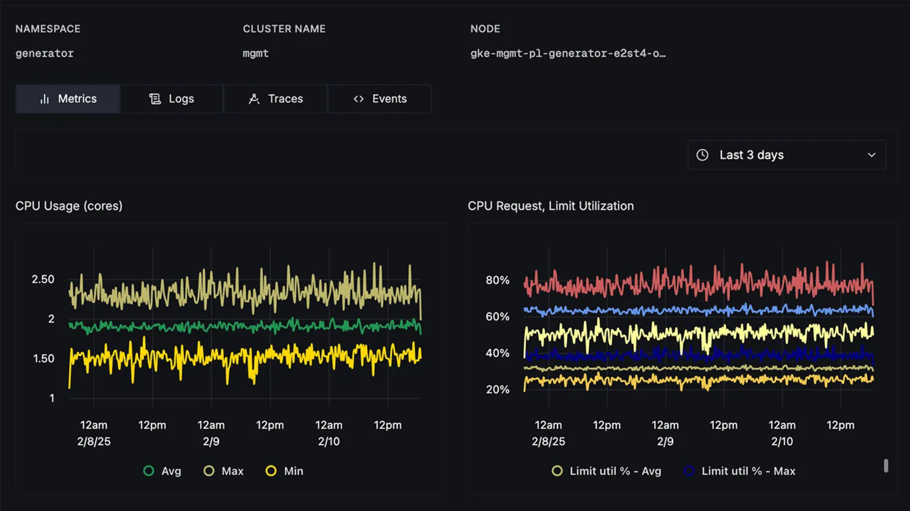
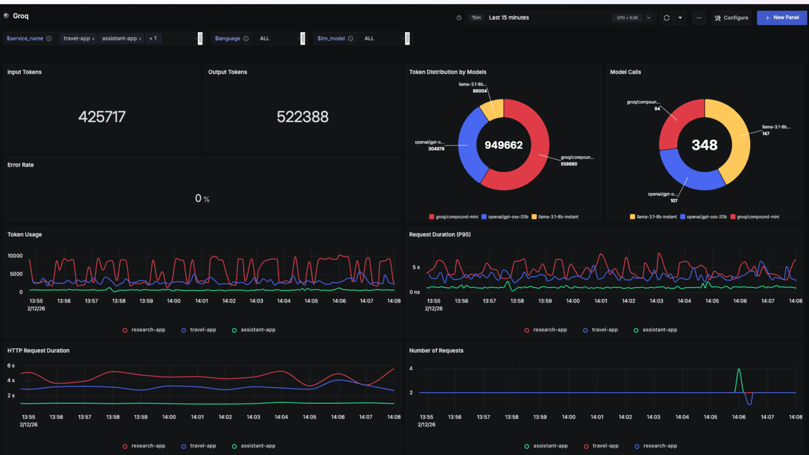
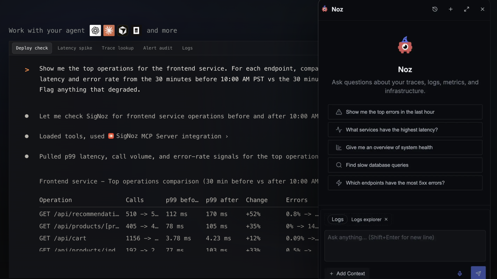
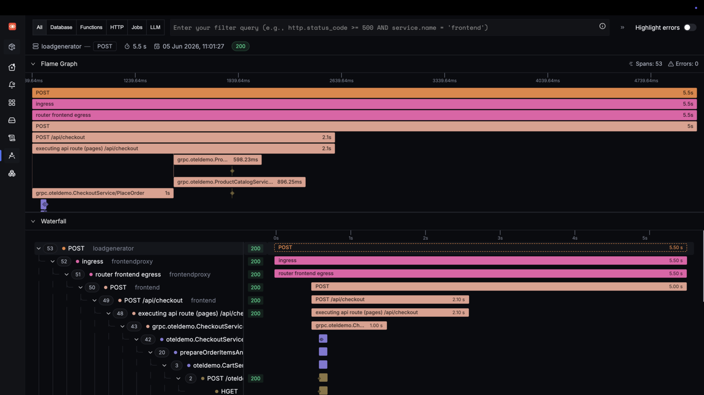
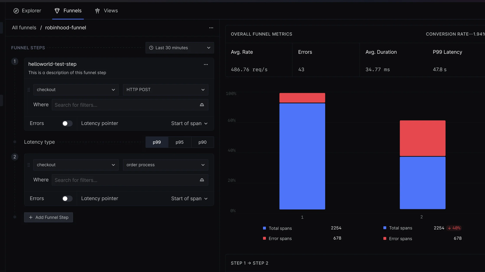

  <picture>
    <source media="(prefers-color-scheme: dark)" srcset="docs/readme-assets/signoz-hero-dark.png" width="900">
    <source media="(prefers-color-scheme: light)" srcset="docs/readme-assets/signoz-hero-light.png" width="900">
    
  </picture>

  <a href="README.md">English</a> ·
  <a href="README.zh-cn.md">中文</a> ·
  <a href="README.de-de.md">Deutsch</a>

  
  
  
  
  

SigNoz é uma plataforma de observabilidade open-source construída sobre OpenTelemetry. Estamos criando uma alternativa de nível empresarial a stacks de monitoramento fragmentadas, com logs, métricas, traces, alertas e dashboards em um só lugar.

### Escolha como executar o SigNoz

#### SigNoz Cloud (recomendado)

SigNoz totalmente gerenciado, com teste gratuito de 30 dias, sem cartão de crédito, preço baseado em uso a partir de US$ 49 e hospedagem de dados por região.

[**Comece gratuitamente →**](https://signoz.io/teams/)

#### Enterprise

Enterprise Cloud, BYOC ou Enterprise Self-Hosted com compliance, suporte, retenção personalizada, RBAC, controles de ingestão, residência de dados e seleção de região.

[**Conheça o Enterprise →**](https://signoz.io/enterprise/)

#### Community

SigNoz open-source gratuito, executado na sua própria infraestrutura. Faça o deploy com Docker, Kubernetes ou Linux e mantenha controle total sobre o seu plano de dados.

[**Instale o SigNoz →**](https://signoz.io/docs/install/self-host/)

### O que você pode monitorar?

O SigNoz ajuda equipes a depurar problemas de produção mais rapidamente ao conectar logs, métricas, traces, alertas, dashboards, exceções e fluxos agent-native em um só lugar.

#### Visão geral de APM

Monitore latência de serviço, taxa de erro, throughput, Apdex, principais endpoints, chamadas ao banco de dados e chamadas externas.

  

Saiba mais: [documentação de APM](https://signoz.io/docs/instrumentation/overview/)

#### Gerenciamento de logs

Ingira, pesquise, agregue e correlacione logs com traces e métricas usando um construtor visual de consultas.

  

Saiba mais: [documentação de gerenciamento de logs](https://signoz.io/docs/logs-management/overview/)

#### Métricas e dashboards

Crie dashboards para métricas de aplicação, infraestrutura e métricas personalizadas usando Query Builder, PromQL ou ClickHouse SQL.

  

Saiba mais: [documentação de métricas](https://signoz.io/docs/metrics-management/overview/)

#### Monitoramento de infraestrutura

Monitore clusters Kubernetes, pods, nodes, workloads e CPU, memória, disco, rede, logs e traces em nível de host.

  

Saiba mais: [documentação de monitoramento de infraestrutura](https://signoz.io/docs/infrastructure-monitoring/overview/)

#### Observabilidade de LLM e AI

Rastreie apps LLM, pipelines RAG, prompts, chamadas de ferramentas, tokens, latência e custos junto com telemetria de aplicação e infraestrutura.

  

Saiba mais: [documentação de observabilidade de LLM](https://signoz.io/docs/llm-observability/)

#### Observabilidade agent-native e MCP

Use o servidor MCP do SigNoz para levar telemetria aos agentes de programação, ou use o Noz dentro do SigNoz para investigar incidentes, ajustar alertas e criar dashboards com contexto de produção. O [Noz](https://signoz.io/docs/ai/noz/) está disponível apenas no SigNoz Cloud.

  

Saiba mais: [documentação do servidor MCP do SigNoz](https://signoz.io/docs/ai/signoz-mcp-server/) · [documentação de agent skills](https://signoz.io/docs/ai/agent-skills/#install-the-plugin)

#### Tracing distribuído

Acompanhe requisições entre serviços com flamegraphs, waterfalls, eventos de span, filtros e análise de traces.

  

Saiba mais: [documentação de tracing distribuído](https://signoz.io/docs/instrumentation/)

#### Trace Funnels

Crie funis a partir de traces para entender quedas no fluxo de requisições, transições com falha e problemas sistêmicos de workflow.

  

Saiba mais: [documentação de Trace Funnels](https://signoz.io/docs/trace-funnels/overview/)

Também monitore: [**exceções**](https://signoz.io/docs/userguide/exceptions/), [**alertas**](https://signoz.io/docs/alerts/), [**APIs externas**](https://signoz.io/docs/external-api-monitoring/overview/) e [**integrações**](https://signoz.io/docs/integrations/integrations-list/) para OpenTelemetry, Prometheus, Kubernetes, provedores de nuvem, SDKs de linguagem, frameworks de aplicação, bancos de dados e ferramentas de LLM.

### Por que equipes usam o SigNoz

1. **Nativo em OpenTelemetry** 
   Instrumente uma vez com padrões abertos e mantenha a posse da sua telemetria.
2. **Sinais correlacionados** 
   Vá de gráficos de serviço para traces, logs, métricas de infraestrutura e exceções sem trocar de ferramenta.
3. **Um único banco de dados colunar** 
   Construído para workloads de observabilidade de alto volume e alta cardinalidade.
4. **Preço previsível** 
   Sem cobrança por host, sem cobrança por usuário e sem preço especial para métricas personalizadas.
5. **Pronto para enterprise** 
   Compliance SOC 2 Type II e HIPAA, RBAC, controles de ingestão, retenção personalizada, suporte, BYOC e self-hosting.

### Primeiros passos

#### Comece na Cloud

Crie um workspace gerenciado do SigNoz e obtenha seu primeiro dashboard sem operar infraestrutura de observabilidade.

[**Comece gratuitamente no SigNoz Cloud**](https://signoz.io/teams/)

#### Self-host SigNoz

Execute o SigNoz na sua própria infraestrutura com Foundry, Docker, Kubernetes ou Linux.

[**Foundry**](https://github.com/SigNoz/foundry) · [**Docker**](https://signoz.io/docs/install/docker/) · [**Kubernetes**](https://signoz.io/docs/install/kubernetes/) · [**Linux**](https://signoz.io/docs/install/linux/)

#### Envie dados

Instrumente aplicações e infraestrutura com OpenTelemetry, Prometheus, SDKs de linguagem e integrações.

[**Instrumentação**](https://signoz.io/docs/instrumentation/) · [**Integrações**](https://signoz.io/docs/integrations/integrations-list/)

### Comparações com ferramentas conhecidas

O SigNoz é frequentemente adotado por equipes que estão migrando de ferramentas de propósito único ou plataformas comerciais com preços imprevisíveis.

**Prometheus** 
Bom se você precisa apenas de métricas. O SigNoz mantém métricas, logs, traces, dashboards e alertas juntos para que equipes possam depurar com contexto correlacionado.

**Jaeger** 
Jaeger faz apenas tracing distribuído. O SigNoz adiciona métricas, logs, análise de traces, dashboards, alertas, exceções e fluxos de trace para log.

**Elastic** 
O SigNoz usa banco de dados colunar para análises de observabilidade eficientes e workloads de logs de alta cardinalidade, com 50% menos necessidade de recursos em comparação ao Elastic durante a ingestão. Confira o [estudo detalhado](https://signoz.io/blog/logs-performance-benchmark/?utm_source=github-readme&utm_medium=logs-benchmark).

**Loki** 
No benchmark vinculado, o SigNoz indexou todas as chaves na configuração de teste, enquanto o Loki atingiu erros de max streams ao adicionar mais labels. Confira o [estudo detalhado](https://signoz.io/blog/logs-performance-benchmark/?utm_source=github-readme&utm_medium=logs-benchmark).

## Contribuindo

Adoramos contribuições grandes ou pequenas. Leia [CONTRIBUTING.md](CONTRIBUTING.md) para começar a contribuir com o SigNoz.

Não sabe como começar? **Fale conosco no `#contributing` na nossa [comunidade Slack](https://signoz.io/slack).**

Como sempre, obrigado aos nossos incríveis contribuidores!

