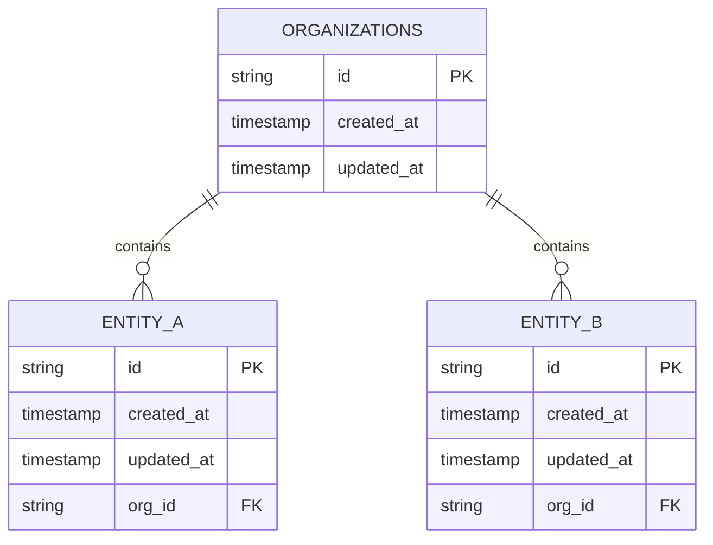

# SQL
SigNoz utilizes a relational database to store metadata including organization information, user data and other settings.

## How to use it?

The database interface is defined in [SQLStore](/pkg/sqlstore/sqlstore.go). SigNoz leverages the Bun ORM to interact with the underlying database. To access the database instance, use the `BunDBCtx` function. For operations that require transactions across multiple database operations, use the `RunInTxCtx` function. This function embeds a transaction in the context, which propagates through various functions in the callback.

```go
type Thing struct {
	bun.BaseModel

	ID            types.Identifiable  `bun:",embed"`
	SomeColumn    string              `bun:"some_column"`
	TimeAuditable types.TimeAuditable `bun:",embed"`
	OrgID         string              `bun:"org_id"`
}

func GetThing(ctx context.Context, id string) (*Thing, error) {
	thing := new(Thing)
	err := sqlstore.
        BunDBCtx(ctx).
        NewSelect().
        Model(thing).
        Where("id = ?", id).
        Scan(ctx)

    return thing, err
}

func CreateThing(ctx context.Context, thing *Thing) error {
	return sqlstore.
        BunDBCtx(ctx).
        NewInsert().
        Model(thing).
        Exec(ctx)
}
```

> 💡 **Note**: Always use line breaks while working with SQL queries to enhance code readability.

> 💡 **Note**: Always use the `new` function to create new instances of structs.

## What are hooks?

Hooks are user-defined functions that execute before and/or after specific database operations. These hooks are particularly useful for generating telemetry data such as logs, traces, and metrics, providing visibility into database interactions. Hooks are defined in the [SQLStoreHook](/pkg/sqlstore/sqlstore.go) interface.

## How is the schema designed?

SigNoz implements a star schema design with the organizations table as the central entity. All other tables link to the organizations table via foreign key constraints on the `org_id` column. This design ensures that every entity within the system is either directly or indirectly associated with an organization.



> 💡 **Note**: There are rare exceptions to the above star schema design. Consult with the maintainers before deviating from the above design.

All tables follow a consistent primary key pattern using a `id` column (referenced by the `types.Identifiable` struct) and include `created_at` and `updated_at` columns (referenced by the `types.TimeAuditable` struct) for audit purposes.

## How to write migrations?

For schema migrations, use the [SQLMigration](/pkg/sqlmigration/sqlmigration.go) interface and write the migration in the same package. When creating migrations, adhere to these guidelines:

- Do not implement **`ON CASCADE` foreign key constraints**. Deletion operations should be handled explicitly in application logic rather than delegated to the database.
- Do not **import types from the types package** in the `sqlmigration` package. Instead, define the required types within the migration package itself. This practice ensures migration stability as the core types evolve over time.
- Do not implement **`Down` migrations**. As the codebase matures, we may introduce this capability, but for now, the `Down` function should remain empty.
- Always write **idempotent** migrations. This means that if the migration is run multiple times, it should not cause an error.
- A migration which is **dependent on the underlying dialect** (sqlite, postgres, etc) should be written as part of the [SQLDialect](/pkg/sqlstore/sqlstore.go) interface. The implementation needs to go in the dialect specific package of the respective database.

## What should I remember?

- Use `BunDBCtx` and `RunInTxCtx` to access the database instance and execute transactions respectively.
- While designing new tables, ensure the consistency of `id`, `created_at`, `updated_at` and an `org_id` column with a foreign key constraint to the `organizations` table (unless the table serves as a transitive entity not directly associated with an organization but indirectly associated with one).
- Implement deletion logic in the application rather than relying on cascading deletes in the database.
- While writing migrations, adhere to the guidelines mentioned above.
