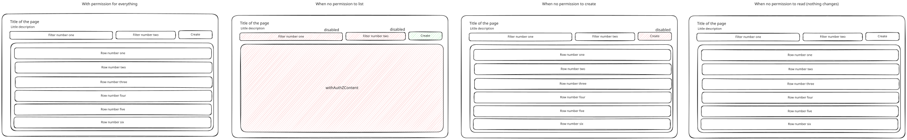
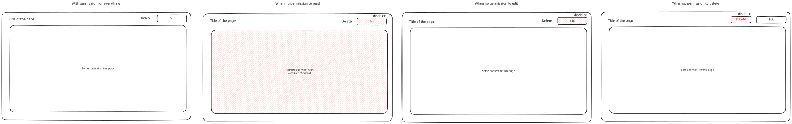
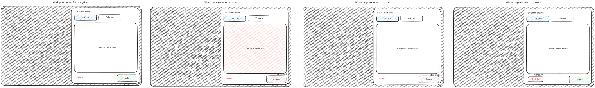
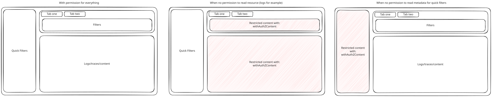

# AuthZ Guide

How to structure a page so it works with the permission system.

We are migrating from the `ADMIN | EDITOR | VIEWER` roles to per-action checks. Instead of granting `VIEWER` and
exposing everything, a user can now be granted access to a single resource, eg: `Logs` only.

- [Prerequisites](#prerequisites)
- [Core rules](#core-rules)
- [Page patterns](#page-patterns)
- [What "blocked" means](#what-blocked-means)
- [Migration checklist](#migration-checklist)
- [Testing](#testing)

## Prerequisites

Check whether the resource your page represents is supported: see
[permissions.type.ts](../src/lib/authz/hooks/useAuthZ/permissions.type.ts) for the current resources and their allowed
verbs.

**If the resource is not listed there, skip authz for now**. The backend does not enforce it yet, so any frontend
check would be decorative. Revisit once the resource is generated into that file (it is auto-generated from the
backend).

## Core rules

These hold for every page. The per-pattern sections below only add to them.

1. **A page is always reachable, regardless of permission.** The intended action must be known before permission can
   be checked, so the route renders first and individual pieces are gated.
2. **`update` requires both `read` and `update`.** A user who can write but cannot read the current value must not get
   an edit affordance.
3. **`delete` is independent of `read`.** Delete controls stay visible for a user who holds `delete` but not `read`.
4. **Never gate per row.** If a user can `list`, render every row. Check `read` only when the row is opened (drawer or
   detail route).
5. **Gate the narrowest thing that works**, a button over a section, a section over a page.
6. **A resource may be gated while a sub-resource is not.** A user without `read` on Service Accounts can still hold
   `create` on API Keys, so blocking the outer container would hide work they are allowed to do.
7. **Verbs not covered here** (`attach`, `detach`, `assignee`) behave like `delete`: gate the control that triggers
   them, not the surrounding content.

## Page patterns

### List page

Without `list`, but with any of `read` / `create` / `update`, only the table is blocked:

- Title, description, search filters and action buttons stay visible.
- Filters and any control that drives the table are non-interactive.
- The create button stays enabled if the user holds `create`.

### Edit page

Without `read`:

- Block the content with `withAuthZContent`, not the whole route.
- Keep delete visible (rule 3).
- Keep update blocked (rule 2).

### Drawer

Without `read`:

- Block the drawer body, not the drawer itself.
- Prefer routing that carries the resource ID in the URL, so delete stays reachable without `read`.
- Keep update blocked (rule 2).
- Watch for sub-resources the user may still be allowed to act on (rule 6).

### Create

Without `create`:

| Entry point           | Gate with                                                     |
| --------------------- | ------------------------------------------------------------- |
| Button                | `AuthZButton`                                                 |
| Dedicated create page | `withAuthZPage`                                               |
| Create drawer opened directly (deep link) | `withAuthZContent` on the body + `AuthZButton` on footer actions |

### Delete

Gate the control with `AuthZButton`, or `AuthZTooltip` for a non-button trigger such as an icon or menu item.

### Quick filters

## What "blocked" means

Blocking is always a visible denial, never a silent removal. Use the components in
[`lib/authz/components`](../src/lib/authz/components/README.md) rather than hand-rolling a check, they carry the
denial message and the loading state.

| Scope           | Component                                 | Denied state                                |
| --------------- | ----------------------------------------- | ------------------------------------------- |
| Button          | `AuthZButton`                             | Disabled + tooltip                          |
| Any element      | `AuthZTooltip`                            | Disabled child + tooltip                    |
| Section         | `withAuthZContent` / `AuthZGuardContent`  | Inline `PermissionDeniedCallout`            |
| Page / route    | `withAuthZPage` / `AuthZGuardPage`        | `PermissionDeniedFullPage`                  |
| Custom fallback | `withAuthZ` / `AuthZGuard`                | Whatever you pass as `fallback`             |

Prefer the HOC (`withAuthZ*`); reach for the JSX guard (`AuthZGuard*`) when the gate depends on conditional rendering
and an HOC cannot express it. The components README has the full decision tree and how to build the `checks` array.

## Migration checklist

Use the existing components. Create a new one only if none fit.

- [ ] Can I apply a `withAuthZ*` variant directly, or must I extract the content into a component first?
  - If extraction is needed, declare the new content component in the same file to keep the diff small, then move it
    to its own file in a follow-up commit or PR.
- [ ] Is the layout structured to respect the [core rules](#core-rules)?
  - If not, raise it in the frontend Slack channel before reshaping the page.
- [ ] Am I gating a shared component rather than a page or section?
  - If so, it must stay functional with no permission. Example: the Query Builder works without field suggestions when
    the user cannot read them.

## Testing

### Devtool

Press `Cmd + K` (`Ctrl + K` on Windows/Linux) to open the shortcuts, search for `AuthZ`, and pick the first
result. The devtool simulates granted and denied permissions across the UI.

Available only in local development, it is stripped from production builds.

### Unit tests

[`lib/authz/utils/README.md`](../src/lib/authz/utils/README.md) covers the `*.authz.test.tsx` naming convention, the
MSW handlers (`setupAuthzAdmin`, `setupAuthzDenyAll`, `setupAuthzDeny`, `setupAuthzAllow`,
`setupAuthzGrantByPrefix`), and how to test the loading state.
