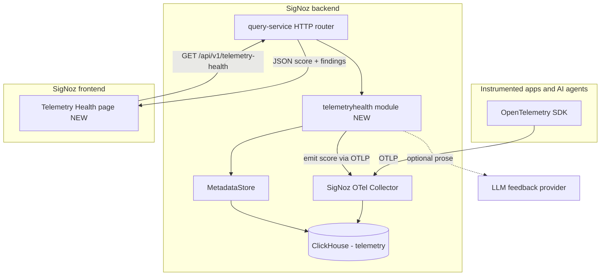
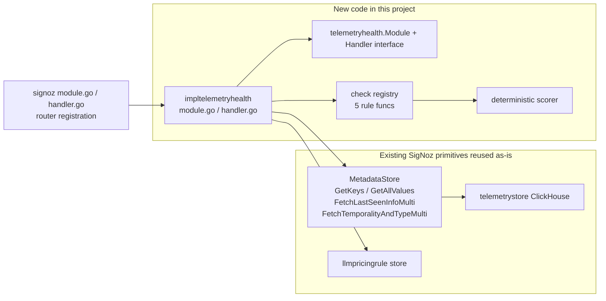
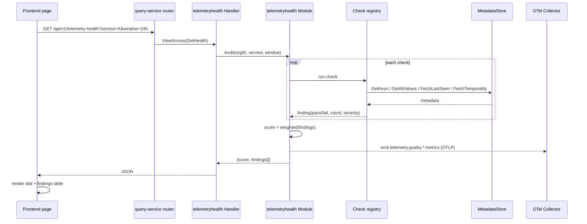
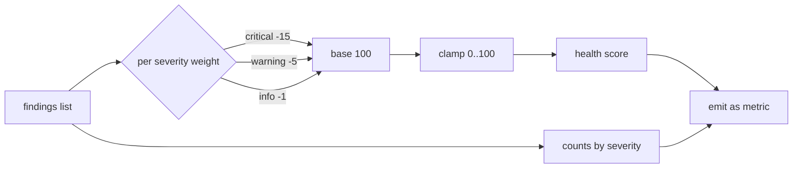
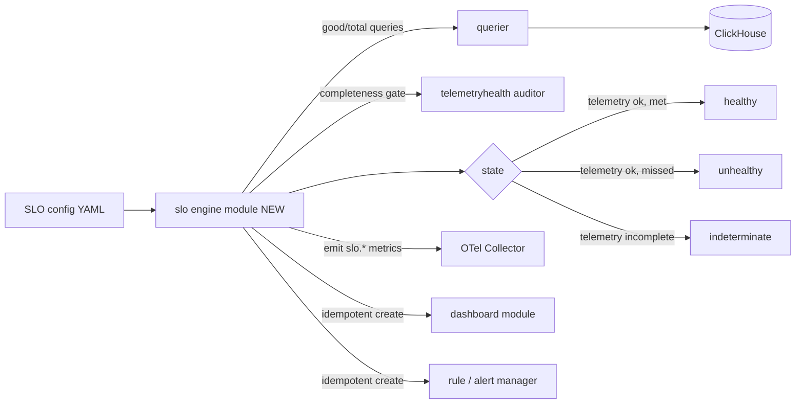
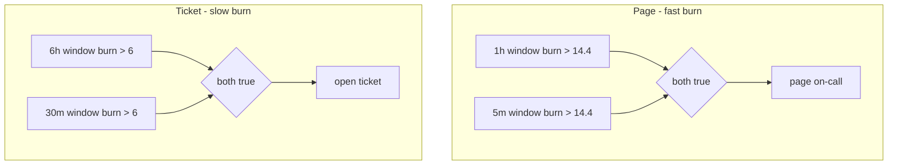

# PRD: Inbuilt Telemetry Health Auditor

Status: Draft (design only, no implementation in this PR)
Owner: NarayanaSabari
Target: `guruvedhanth-s/signoz` fork (hackathon)
Repo base for file links: `https://github.com/guruvedhanth-s/signoz/blob/main`

---

## 1. Executive summary

This project adds a native reliability layer inside SigNoz that grades the quality of the telemetry SigNoz itself ingests.

Today SigNoz stores, queries, visualizes, and alerts on logs, metrics, and traces.
It does not tell you whether that telemetry is complete, correct, affordable, or trustworthy.
Teams routinely build dashboards and alerts on top of telemetry that is missing `service.name`, has broken trace parent-child links, ships unmapped LLM models, or emits unbounded-cardinality metric labels.
When the underlying data is wrong, every dashboard and SLO built on it is quietly wrong too.

The Telemetry Health Auditor is a new SigNoz module that inspects the telemetry metadata already stored in ClickHouse, runs a deterministic set of quality checks, produces a health score with actionable findings, and emits that score back into SigNoz as a first-class metric.
An optional LLM feedback layer turns each structured finding into human-readable guidance and a suggested instrumentation fix, without ever influencing the numeric score.

The core insight is that this is not a rebuild.
SigNoz already exposes a `MetadataStore` interface that can enumerate every attribute key, list distinct values, report last-seen timestamps, and fetch metric temporality and type.
The auditor composes those existing primitives into a scoring engine.
That inversion (a small amount of new logic on top of a large amount of existing plumbing) is what makes this feasible as a hackathon deliverable.

---

## 2. Problem statement

Observability decisions are only as good as the telemetry behind them.

1. Can we trust the telemetry being ingested into SigNoz?
2. Is the developer emitting logs and metrics that are complete, correctly typed, cost-controlled, and queryable?

Traditional observability answers "did the request fail" and "how slow was it".
It does not answer "is my instrumentation good enough to be believed".
This gap is worse for AI agents, where a request can return HTTP 200 with no exception while still producing an ungrounded answer, a missing model attribute, or an unmapped pricing model that silently breaks cost tracking.

The auditor closes this gap by continuously grading telemetry quality and coaching the developer on how to improve it.

### Related open SigNoz issues this validates

| Issue | Relationship |
|---|---|
| [#11666 Telemetry data quality checker](https://github.com/SigNoz/signoz/issues/11666) | Direct validation for the auditor concept. |
| [#4654 High-cardinality span names](https://github.com/SigNoz/signoz/issues/4654) | Backs the cardinality checks. |
| [#8715 Inactive services](https://github.com/SigNoz/signoz/issues/8715) | Backs the stale-service check. |
| [#5230 Ingested data visibility and control](https://github.com/SigNoz/signoz/issues/5230) | Backs the ingestion inventory view. |
| [#2064 Cost control of observability data](https://github.com/SigNoz/signoz/issues/2064) | Backs the cardinality and cost findings. |

---

## 3. Goals and non-goals

### Goals

1. Provide a deterministic, reproducible telemetry health score per service and per signal.
2. Run at least 5 quality checks against real telemetry using existing SigNoz storage primitives.
3. Emit the score and finding counts back into SigNoz as metrics so they render on a normal dashboard.
4. Ship a dedicated in-product page that shows the score, the findings, the affected telemetry, and a recommended fix.
5. Use an LLM only to phrase developer feedback, never to compute the score.

### Non-goals

1. Rebuilding ingestion, storage, dashboards, alerting, or LLM tracing that SigNoz already provides.
2. Applying destructive remediation automatically. Recommendations are read-only in the MVP.
3. Depending on SigNoz Cloud only features such as Noz. The auditor must work on a self-hosted stack.
4. Automatic destructive remediation. All remediation stays behind explicit human approval.

---

## 4. Personas and user stories

Persona: Application developer instrumenting a service or AI agent.

- As a developer, I want a single score that tells me if my telemetry is good, so I know whether my dashboards can be trusted.
- As a developer, I want each problem to link to the exact traces or metrics affected, so I can reproduce it.
- As a developer, I want a copy-pasteable fix for each finding, so I can improve my instrumentation quickly.

Persona: Platform or SRE owner enforcing telemetry standards.

- As a platform owner, I want an org-wide health score trend, so I can gate teams before their dashboards reach production.
- As a platform owner, I want the score as a metric, so I can alert when quality regresses.

---

## 5. Scope

The team is four people, so the build runs as two parallel tracks that meet at the `indeterminate` coupling.
Track A is the Telemetry Health Auditor.
Track B is the SLO and Error-Budget Engine.
Both ship in the hackathon.

### Track A: Telemetry Health Auditor (in scope)

- Backend module `telemetryhealth` exposing `GET /api/v1/telemetry-health`.
- Five checks: `missing_service_name`, `missing_model_name`, `missing_token_usage`, `high_cardinality_attribute`, `stale_service`.
- Deterministic weighted score.
- Score emitted back as OTLP metrics.
- One frontend page with score, findings table, and per-finding fix text.
- Deterministic broken-then-fixed demo dataset that moves the score from roughly 48 to 94.

### Track B: SLO and Error-Budget Engine (in scope, fully specified in section 14)

- SLO definitions as typed YAML config.
- Four SLI types: ratio, latency threshold, completeness, grounded answers.
- Compliance, error budget, and multi-window multi-burn-rate (MWMB) computation.
- The `healthy` / `unhealthy` / `indeterminate` state machine, gated by the auditor.
- SLO metrics emitted back via OTLP.
- Programmatically generated SLO dashboard and burn-rate alerts, created idempotently.
- Human-approved remediation recommendations and config patches.
- Frontend SLO page: compliance, remaining error budget, burn rate, and trust state.

### Stretch (attempt if time allows)

- LLM feedback layer generating prose and SDK snippets per finding.
- More auditor checks: trace parent-child integrity, missing error status, counter/gauge misuse, missing severity on logs, trace-log correlation.
- Remediation delivered as an actual pull request rather than a copyable patch.

---

## 6. Architecture

### 6.1 System context



### 6.2 Where the new module sits inside SigNoz



### 6.3 Request and scoring flow



### 6.4 Scoring pipeline



---

## 7. Check catalog (MVP)

Every check is backed by an existing method on the `MetadataStore` interface defined in
[`pkg/types/telemetrytypes/store.go`](https://github.com/guruvedhanth-s/signoz/blob/main/pkg/types/telemetrytypes/store.go).
No new ClickHouse SQL is required for the MVP.

| Check id | Severity | What it detects | Backing primitive |
|---|---|---|---|
| `missing_service_name` | critical | Spans or metrics without `service.name` on the resource | `GetKeys()` then confirm presence of the `service.name` key |
| `missing_model_name` | critical | LLM spans without `gen_ai.request.model` | `GetKeys()` filtered to gen_ai keys |
| `missing_token_usage` | warning | LLM spans without `gen_ai.usage.input_tokens` / `output_tokens` | `GetKeys()` filtered to token keys |
| `high_cardinality_attribute` | warning | Attributes whose distinct value count exceeds a threshold | `GetAllValues()` and count via `NumValues()` |
| `stale_service` | warning | Services or metrics with no data past a staleness window | `FetchLastSeenInfoMulti()` |

Phase 2 candidate checks and their backing primitive:

| Check id | Backing primitive |
|---|---|
| `counter_gauge_misuse` | `FetchTemporalityAndTypeMulti()` |
| `unmapped_llm_model` | `GetAllValues()` on model attr cross-referenced with the llmpricingrule store in [`pkg/types/llmpricingruletypes`](https://github.com/guruvedhanth-s/signoz/blob/main/pkg/types/llmpricingruletypes) |
| `broken_trace_context` | querier over the traces table (parent span id resolution) |

---

## 8. Deterministic scoring model

The score must be reproducible: identical telemetry in produces an identical score out.
The LLM never touches this computation.

```text
score = clamp(100
              - 15 * count(critical)
              -  5 * count(warning)
              -  1 * count(info),
              0, 100)
```

Each finding has a stable shape:

```json
{
  "rule": "missing_service_name",
  "severity": "critical",
  "affected_signal": "traces",
  "affected_count": 18,
  "sample_query": "https://<signoz-host>/traces-explorer?...",
  "recommendation": "Set service.name in the OpenTelemetry Resource."
}
```

Response envelope:

```json
{
  "score": 48,
  "counts": { "critical": 1, "warning": 3, "info": 2 },
  "window": "24h",
  "service": "support-agent",
  "findings": [ /* array of finding objects */ ]
}
```

---

## 9. Emitted metrics schema

The auditor emits its own results back into SigNoz via OTLP so they render on a normal dashboard and can be alerted on.

| Metric | Type | Labels |
|---|---|---|
| `telemetry.quality.score` | gauge | `service`, `org` |
| `telemetry.quality.findings` | gauge | `service`, `severity` |
| `telemetry.quality.critical_findings` | gauge | `service` |
| `telemetry.quality.high_cardinality_series` | gauge | `service`, `attribute` |
| `telemetry.quality.unmapped_models` | gauge | `service` |

---

## 10. API contract

`GET /api/v1/telemetry-health`

Query params:

- `service` optional, scopes to one service, otherwise all services in the org.
- `window` optional, defaults to `24h`, bounds every underlying query.
- `signal` optional, one of `traces` / `metrics` / `logs`.

Auth: `ViewAccess` middleware, matching the pattern already used for
[`/api/v1/orgs/me/filters`](https://github.com/guruvedhanth-s/signoz/blob/main/pkg/query-service/app/http_handler.go#L551).

All queries are time-bounded and row-limited to keep the auditor cheap and safe.

---

## 11. Backend module design

Follow the existing SigNoz module pattern used by `quickfilter`.

Interface package `pkg/modules/telemetryhealth/telemetryhealth.go`:

```go
package telemetryhealth

type Module interface {
    Audit(ctx context.Context, orgID valuer.UUID, params AuditParams) (*Report, error)
}

type Handler interface {
    GetHealth(http.ResponseWriter, *http.Request)
}
```

Implementation package `pkg/modules/telemetryhealth/impltelemetryhealth/`:

- `module.go` orchestrates the check registry and computes the score.
- `handler.go` parses params, calls the module, writes JSON.
- `checks.go` holds the 5 check functions, each taking `MetadataStore` and returning a `Finding`.
- `emitter.go` pushes `telemetry.quality.*` metrics via OTLP.

Types live in a new `pkg/types/telemetryhealthtypes/` package (`report.go`, `finding.go`, `severity.go`) to match the repo convention of one types package per domain.

---

## 12. Frontend design

A single new page rendered inside the existing app shell.

- Route added to [`frontend/src/AppRoutes/routes.ts`](https://github.com/guruvedhanth-s/signoz/blob/main/frontend/src/AppRoutes/routes.ts) and path constant to [`frontend/src/constants/routes.ts`](https://github.com/guruvedhanth-s/signoz/blob/main/frontend/src/constants/routes.ts).
- Page component under `frontend/src/pages/TelemetryHealth/`.
- Container with the data fetching hook under `frontend/src/container/TelemetryHealth/`.
- Data fetched via a react-query hook calling `GET /api/v1/telemetry-health`.

Layout: a score dial at the top, a severity summary row, and a findings table.
Each findings row shows severity, affected signal, affected count, recommendation text, and a link to the relevant traces or metrics explorer query.
CSS Modules per the frontend conventions in [`frontend/CLAUDE.md`](https://github.com/guruvedhanth-s/signoz/blob/main/frontend/CLAUDE.md).

---

## 13. LLM feedback layer (Phase 2, bounded)

The LLM is a presentation layer only.

- Input: a structured `Finding`.
- Output: a friendly explanation plus a suggested SDK snippet.
- It never returns or alters the numeric score.
- It is optional and the page works fully without it.

This mirrors how SigNoz itself separates its deterministic query engine from the Noz AI layer.

---

## 14. SLO and Error-Budget Engine (all-in)

### 14.1 Overview

The SLO engine is the second half of the product and the reason the auditor matters.
SigNoz has no native SLO support today, confirmed by open issues [#658](https://github.com/SigNoz/signoz/issues/658) and [#5374](https://github.com/SigNoz/signoz/issues/5374).
The engine reads SLO definitions as code, translates them into bounded SigNoz queries, and computes the SLI, the SLO compliance, the remaining error budget, and the multi-window burn rate.
The differentiator is the coupling to the auditor: if the telemetry required to compute an SLO is incomplete, the engine returns `indeterminate` instead of a false pass.
No other team will have that.



### 14.2 SLO-as-code configuration

SLOs are declared in typed YAML, validated on load, and version-controllable.

```yaml
service: support-agent
environment: local

slos:
  - name: successful-agent-runs
    description: Agent runs should complete without an error.
    type: ratio
    target: 99%
    window: 30d
    good_query: agent.requests - agent.errors
    total_query: agent.requests
    requires_completeness: true   # gate on the auditor

  - name: model-latency
    description: Model calls should complete within three seconds.
    type: latency_threshold
    target: 99%
    window: 30d
    threshold: 3000ms
    latency_metric: gen_ai.server.request.duration

  - name: telemetry-completeness
    description: Agent runs should contain the expected trace tree.
    type: completeness
    target: 98%
    window: 7d
    expected_spans: [agent.run, retrieve.documents, model.chat]

  - name: grounded-answers
    description: Answers should be supported by retrieved evidence.
    type: grounded_answers
    target: 95%
    window: 30d
    verdict_attribute: evaluation.grounded
```

### 14.3 SLI computation

Each SLI type maps to a bounded querier call. No unbounded scans.

| Type | SLI formula | How it is computed |
|---|---|---|
| `ratio` | good / total | Two counter queries from `good_query` and `total_query`. |
| `latency_threshold` | requests under threshold / total | Percentile / bucketed count over `latency_metric`. |
| `completeness` | traces with all `expected_spans` / total traces | Trace query checking span presence per trace tree. |
| `grounded_answers` | count(`verdict_attribute` = true) / total answers | Attribute count over agent spans. |

### 14.4 The trust state machine

This is the heart of the project.
The SLO result is never reported in isolation from telemetry quality.


Definition of the three states:

```text
healthy       = telemetry is complete AND SLI >= target
unhealthy     = telemetry is complete AND SLI <  target
indeterminate = telemetry is incomplete, so the SLO cannot be trusted
```

The gate reuses the auditor: an SLO with `requires_completeness: true` calls the `telemetryhealth` module for the same service and window, and if the completeness-related findings exceed a configured threshold the SLO short-circuits to `indeterminate`.

### 14.5 Error budget

For a target `T` over a window with `total` events:

```text
error_budget          = (1 - T) * total
bad_events            = total - good
error_budget_remaining = error_budget - bad_events
budget_consumed_pct    = bad_events / error_budget
```

Example: target 99%, 10,000 requests, budget is 100 failures.
With 40 failures observed, 60 remain and 40% of the budget is consumed.

### 14.6 Multi-window multi-burn-rate alerting

Burn rate measures how fast the budget is being consumed.

```text
burn_rate = observed_error_rate / (1 - target)
```

A burn rate of 1 exactly exhausts the budget by the end of the window.
Higher means faster.
We follow the Google SRE multi-window multi-burn-rate approach to balance fast detection against false positives: a fast burn pages, a slow burn tickets, and each alert requires both a long and a short window to fire.



| Alert | Long window | Short window | Burn threshold | Budget spent if sustained | Severity |
|---|---|---|---|---|---|
| Fast | 1h | 5m | 14.4x | 2% in 1h | page |
| Medium | 6h | 30m | 6x | 5% in 6h | ticket |
| Slow | 24h | 2h | 3x | 10% in 24h | ticket |

Implementation note: to avoid the upstream formula-alert bugs ([#10823](https://github.com/SigNoz/signoz/issues/10823), [#10881](https://github.com/SigNoz/signoz/issues/10881)), the engine precomputes each window burn rate itself and emits it as a plain metric.
Alerts are then simple threshold rules over those metrics, not query-service formulas.

### 14.7 Emitted SLO metrics

| Metric | Type | Labels |
|---|---|---|
| `slo.compliance` | gauge | `service`, `slo`, `window` |
| `slo.state` | gauge (0 unhealthy, 1 healthy, 2 indeterminate) | `service`, `slo` |
| `slo.error_budget_remaining` | gauge | `service`, `slo` |
| `slo.budget_consumed_pct` | gauge | `service`, `slo` |
| `slo.burn_rate` | gauge | `service`, `slo`, `window` |

### 14.8 Generated dashboards and alerts

The engine creates a per-service SLO dashboard and the burn-rate alerts programmatically, reusing the existing dashboard module and rule creation path.

- Dashboard creation reuses [`pkg/modules/dashboard`](https://github.com/guruvedhanth-s/signoz/blob/main/pkg/modules/dashboard).
- Alert creation reuses the `createRule` path at [`pkg/query-service/app/http_handler.go` L673](https://github.com/guruvedhanth-s/signoz/blob/main/pkg/query-service/app/http_handler.go#L673).
- Creation is idempotent: keyed by a stable `slo:<service>:<name>` name, so applying the same config twice updates rather than duplicates.

Dashboard panels: SLO compliance, remaining error budget, budget consumed, burn rate per window, trust state, and the linked telemetry health score.

### 14.9 Remediation engine

Remediation is read-only in the hackathon build.
For each finding or breached SLO the engine produces a recommendation and, where safe, a config patch.

```text
Add service.name to the SDK Resource.
Remove request.id from metric labels.
Add gen_ai.request.model to model spans.
Create a pricing rule for tinyllama.
Raise the trace retention window for audit data.
```

A later version may open a pull request with the patch, but nothing is applied without explicit human approval.

---

## 15. Files to change

New files are marked NEW.
Existing files that need edits link to the current version on the fork.

### Backend

| File | URL | Change |
|---|---|---|
| `pkg/modules/telemetryhealth/telemetryhealth.go` | NEW | Module + Handler interface. |
| `pkg/modules/telemetryhealth/impltelemetryhealth/module.go` | NEW | Orchestrate checks, compute score. |
| `pkg/modules/telemetryhealth/impltelemetryhealth/handler.go` | NEW | HTTP handler, parse params, write JSON. |
| `pkg/modules/telemetryhealth/impltelemetryhealth/checks.go` | NEW | The 5 check functions. |
| `pkg/modules/telemetryhealth/impltelemetryhealth/emitter.go` | NEW | Emit `telemetry.quality.*` metrics via OTLP. |
| `pkg/types/telemetryhealthtypes/report.go` | NEW | `Report`, `AuditParams`. |
| `pkg/types/telemetryhealthtypes/finding.go` | NEW | `Finding` shape. |
| `pkg/types/telemetryhealthtypes/severity.go` | NEW | Severity enum and weights. |
| `pkg/signoz/module.go` | [link](https://github.com/guruvedhanth-s/signoz/blob/main/pkg/signoz/module.go) | Add `TelemetryHealth` to `Modules` struct and construct it in `NewModules`. |
| `pkg/signoz/handler.go` | [link](https://github.com/guruvedhanth-s/signoz/blob/main/pkg/signoz/handler.go) | Add `TelemetryHealth` to `Handlers` and wire in `NewHandlers`. |
| `pkg/query-service/app/http_handler.go` | [link](https://github.com/guruvedhanth-s/signoz/blob/main/pkg/query-service/app/http_handler.go) | Register the auditor route and the SLO routes (`/api/v1/slo`, `/api/v1/slo/{name}`). |

### Backend (Track B: SLO engine)

| File | URL | Change |
|---|---|---|
| `pkg/modules/slo/slo.go` | NEW | SLO `Module` + `Handler` interface. |
| `pkg/modules/slo/implslo/module.go` | NEW | Load config, evaluate SLIs, run the trust state machine. |
| `pkg/modules/slo/implslo/handler.go` | NEW | HTTP handlers for list/get SLO. |
| `pkg/modules/slo/implslo/sli.go` | NEW | The 4 SLI type evaluators. |
| `pkg/modules/slo/implslo/budget.go` | NEW | Error budget and multi-window burn-rate math. |
| `pkg/modules/slo/implslo/gate.go` | NEW | Completeness gate that calls the `telemetryhealth` module. |
| `pkg/modules/slo/implslo/generator.go` | NEW | Idempotent dashboard + alert creation. |
| `pkg/modules/slo/implslo/emitter.go` | NEW | Emit `slo.*` metrics via OTLP. |
| `pkg/types/slotypes/config.go` | NEW | Typed YAML config schema + validation. |
| `pkg/types/slotypes/state.go` | NEW | `healthy` / `unhealthy` / `indeterminate` enum. |
| `pkg/types/slotypes/report.go` | NEW | SLO report shape (compliance, budget, burn). |
| `pkg/signoz/module.go` | [link](https://github.com/guruvedhanth-s/signoz/blob/main/pkg/signoz/module.go) | Add `SLO` to `Modules` and construct it (depends on `TelemetryHealth`, `Dashboard`). |
| `pkg/signoz/handler.go` | [link](https://github.com/guruvedhanth-s/signoz/blob/main/pkg/signoz/handler.go) | Add `SLO` to `Handlers` and wire in `NewHandlers`. |

Reused without modification (referenced for implementation):

| File | URL | Why |
|---|---|---|
| `pkg/types/telemetrytypes/store.go` | [link](https://github.com/guruvedhanth-s/signoz/blob/main/pkg/types/telemetrytypes/store.go) | `MetadataStore` interface backing every check. |
| `pkg/telemetrymetadata/metadata.go` | [link](https://github.com/guruvedhanth-s/signoz/blob/main/pkg/telemetrymetadata/metadata.go) | Concrete metadata store implementation. |
| `pkg/types/llmpricingruletypes` | [link](https://github.com/guruvedhanth-s/signoz/blob/main/pkg/types/llmpricingruletypes) | Pricing rules for the unmapped-model check. |
| `pkg/modules/quickfilter/quickfilter.go` | [link](https://github.com/guruvedhanth-s/signoz/blob/main/pkg/modules/quickfilter/quickfilter.go) | Reference module pattern to copy. |
| `pkg/modules/dashboard` | [link](https://github.com/guruvedhanth-s/signoz/blob/main/pkg/modules/dashboard) | Reused by the SLO generator to create the SLO dashboard. |
| `pkg/querier` | [link](https://github.com/guruvedhanth-s/signoz/blob/main/pkg/querier) | SLI good/total and latency queries. |

### Frontend

| File | URL | Change |
|---|---|---|
| `frontend/src/pages/TelemetryHealth/index.tsx` | NEW | Page component. |
| `frontend/src/pages/TelemetryHealth/TelemetryHealth.module.scss` | NEW | Page styles (CSS Modules). |
| `frontend/src/container/TelemetryHealth/index.tsx` | NEW | Container, renders dial + table. |
| `frontend/src/container/TelemetryHealth/useTelemetryHealth.ts` | NEW | react-query fetch hook. |
| `frontend/src/api/telemetryHealth/getHealth.ts` | NEW | API call. |
| `frontend/src/types/api/telemetryHealth/index.ts` | NEW | Response types. |
| `frontend/src/AppRoutes/routes.ts` | [link](https://github.com/guruvedhanth-s/signoz/blob/main/frontend/src/AppRoutes/routes.ts) | Add the route entry. |
| `frontend/src/AppRoutes/pageComponents.ts` | [link](https://github.com/guruvedhanth-s/signoz/blob/main/frontend/src/AppRoutes/pageComponents.ts) | Lazy import the page. |
| `frontend/src/constants/routes.ts` | [link](https://github.com/guruvedhanth-s/signoz/blob/main/frontend/src/constants/routes.ts) | Add path constants for both pages. |

### Frontend (Track B: SLO engine)

| File | URL | Change |
|---|---|---|
| `frontend/src/pages/SLO/index.tsx` | NEW | SLO overview page. |
| `frontend/src/pages/SLO/SLO.module.scss` | NEW | Page styles (CSS Modules). |
| `frontend/src/container/SLO/index.tsx` | NEW | Compliance, budget, burn rate, and trust-state badge. |
| `frontend/src/container/SLO/useSLO.ts` | NEW | react-query fetch hook. |
| `frontend/src/api/slo/getSLO.ts` | NEW | API call. |
| `frontend/src/types/api/slo/index.ts` | NEW | Response types including the `indeterminate` state. |

---

## 16. Test plan

Backend:

- Unit test each of the 5 check functions against a mocked `MetadataStore` (repo already provides store test harnesses).
- Cover four cases per check: healthy, failing, missing-data, partial-data.
- Unit test the scorer for weight math and clamping.
- Table test the handler for param parsing and the JSON envelope.

Frontend:

- Component test the findings table and score dial using `data-testid` per the frontend conventions.
- Mock the react-query hook.

SLO engine:

- Unit test each of the 4 SLI evaluators against mocked querier results.
- Unit test error budget and burn-rate math with fixed inputs.
- Unit test the state machine, specifically that a failing completeness gate forces `indeterminate` even when the raw SLI would pass.
- Unit test that dashboard and alert generation is idempotent (same config twice, no duplicates).

Integration:

- Run the auditor against the deterministic demo dataset and assert the score is roughly 48 before fixes and roughly 94 after.
- Assert applying the same audit twice does not create duplicate emitted metric series.
- Assert the SLO flips from `indeterminate` to a real number after the instrumentation is fixed.

---

## 17. Demo script (7 minutes)

```text
1. Show an AI-agent trace that looks healthy (HTTP 200, no error).
2. Open the Telemetry Health page. Score is about 48/100.
3. Point out: 18 spans missing service.name, model name absent, request.id high cardinality.
4. Show that the score is also a metric panel on a normal SigNoz dashboard.
5. Open the SLO page. successful-agent-runs shows INDETERMINATE, not green.
6. Read the alert: the SLO cannot be trusted because telemetry is incomplete.
7. Apply the instrumentation fixes from the recommendations.
8. Re-run the auditor. Score climbs to about 94/100.
9. Reopen the SLO page. The state flips to a real number (for example 99.2%) with a live error budget.
10. Trigger a burst of failures. Show the fast-burn alert firing from the precomputed burn-rate metric.
11. Close with the one-line pitch below.
```

Pitch:

> SigNoz can now grade its own telemetry and tell developers exactly which spans are lying to them, as a page inside SigNoz.

---

## 18. Judging criteria mapping

| Criterion | How this project scores |
|---|---|
| Potential Impact | Prevents teams trusting dashboards and SLOs built on broken telemetry. |
| Creativity | A product that audits the trustworthiness of its own data, not another dashboard. |
| Technical Excellence | Deterministic scoring, typed config, bounded queries, unit + integration tests, idempotent metric emission. |
| Best Use of SigNoz | Built inside SigNoz as two modules and two pages, reusing MetadataStore, querier, dashboard, and rule creation, emitting both quality and SLO metrics back into the platform. |
| Reliability engineering depth | First-class SLOs, error budgets, and multi-window multi-burn-rate alerting, an area SigNoz has open (#658, #5374) but unbuilt. |
| User Experience | One page, one score, actionable findings with copy-pasteable fixes and deep links. |
| Presentation | Deterministic before/after demo with a visible score jump. |

---

## 19. Risks and mitigations

| Risk | Mitigation |
|---|---|
| DI and module wiring onboarding cost | Copy the `quickfilter` module verbatim as a scaffold. Get an empty route returning JSON on day one. |
| Heavy local stack (ClickHouse + collector + sqlite + builds) | Stand up the dev stack first, verify a rebuild-and-see-route loop before writing checks. |
| LLM contaminating the score | Score is deterministic and rule-based. LLM is prose-only and optional. |
| Flaky live demo | Drive the demo from a deterministic replayable dataset, not live ingestion. |
| Programmatic alert creation bugs upstream (`#10823`, `#10881`) | The SLO engine precomputes each burn rate as a plain metric and alerts with a simple threshold, avoiding formula-alert code paths entirely. |
| Two tracks diverging across four people | Track A and Track B share the `telemetryhealth` module contract as the only integration point (the completeness gate). Freeze that interface first. |
| Generated dashboard/alert duplication on re-run | All generation is idempotent, keyed by a stable `slo:<service>:<name>` name. |
| Name clash with existing `pkg/telemetryaudit` (the audit-log signal) | Use the distinct name `telemetryhealth` everywhere. |

---

## 20. Open questions

1. Should the score be per-service, per-signal, or a single org-level roll-up for the demo?
2. Which LLM provider do we wire for the Phase 2 feedback prose, and is a key available in the demo environment?
3. Do we want the page in the main side nav for the demo, or reachable by direct URL only?
