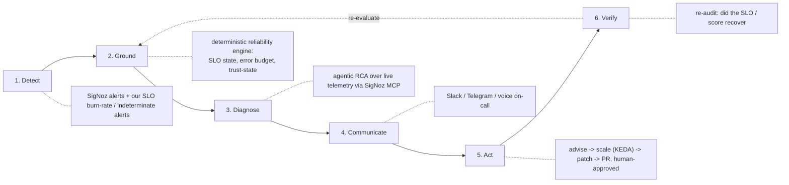
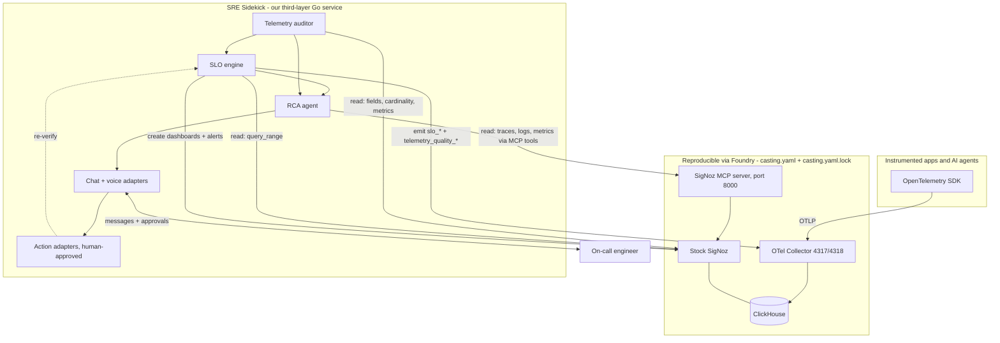
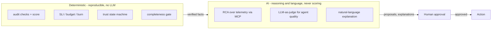

# PRD: SRE Sidekick - an AI reliability agent grounded on SigNoz

Status: Draft for team review
Owner: NarayanaSabari
Target: `guruvedhanth-s/signoz` fork (hackathon: Agents of SigNoz)
Repo base for file links: `https://github.com/guruvedhanth-s/signoz/blob/main`

> Read me first.
> This PRD supersedes the earlier "third-layer SLO engine" draft and folds it into a larger product.
> The SLO and telemetry-audit work already built (the `reliability-agent`) becomes the deterministic, trustworthy **brain** that an AI SRE agent reasons over.
> Fixed constraints (not up for debate): third layer only, stock SigNoz via Foundry, full Go, deterministic scoring, human-in-the-loop for any action.
> Everything else in this document is open for team input; see section 21.

---

## 1. Executive summary

SRE Sidekick is an AI reliability agent that lives on a stock SigNoz deployment and runs the incident loop end to end: it **detects** problems, **grounds** itself in verifiable reliability facts, **diagnoses** root cause by reasoning over live telemetry through the SigNoz MCP server, **tells** an on-call engineer wherever they are, and - only with human approval - **acts** to heal the system, then **verifies** the fix.

The defining idea is grounded, trust-aware AI.
An AI agent that does root-cause analysis is only as good as the telemetry it reasons over.
If the telemetry is incomplete, an ungrounded agent hallucinates a root cause.
SRE Sidekick refuses to.
A deterministic reliability engine (SLOs, error budgets, and a telemetry-trust state) supplies the agent with verifiable facts and, when the data cannot be trusted, forces the agent to say so instead of guessing.

The AI does the work only AI can do (reason over messy telemetry, judge AI-agent output quality, explain in natural language).
The math that must be trustworthy (scores, SLIs, budgets, burn rates, alert thresholds) stays deterministic and reproducible.
Nothing in SigNoz is modified, so the whole stack remains reproducible by Foundry.

---

## 2. Why this, and why now

Classic observability answers "did the request fail and how slow was it".
It does not answer the questions that dominate real incidents and AI systems:

- Why did this break, in plain language, with evidence?
- Can I even trust this dashboard, or is the telemetry incomplete?
- Did the AI agent give an ungrounded or unsafe answer even though it returned HTTP 200?
- What should I do about it, and can something safe be done automatically?

Two gaps compound:

1. Toil: on-call engineers manually pivot across traces, metrics, and logs to build a root cause under pressure.
2. Trust: AI agents fail silently (200 OK, wrong answer), and their telemetry is often incomplete or unstructured, so the dashboards lie.

SRE Sidekick closes both: an agent that grounds itself in trustworthy reliability facts, does the cross-signal RCA a human would, and never pretends to be sure when the data is not.

---

## 3. What it is: five hackathon ideas merged

This product deliberately unifies five SigNoz hackathon issues into one coherent incident loop rather than picking one.

| Issue | Idea | Stage it maps to |
|---|---|---|
| [#11656](https://github.com/SigNoz/signoz/issues/11656) | SRE Sidekick built on SigNoz | the whole loop |
| [#11660](https://github.com/SigNoz/signoz/issues/11660) | Build agents + E2E observability (alert -> RCA -> notify -> approve fix) | Detect, Diagnose, Communicate, Act |
| [#11654](https://github.com/SigNoz/signoz/issues/11654) | Debug production over call with SigNoz MCP | Diagnose (MCP), Communicate (voice) |
| [#11655](https://github.com/SigNoz/signoz/issues/11655) | Observability Slackbot on SigNoz | Communicate (Slack) |
| [#11653](https://github.com/SigNoz/signoz/issues/11653) | Self-healing infra (KEDA scaler / autoscaling advisor) | Act (self-heal) |

They are all one thing: an AI SRE agent on SigNoz that runs detect -> diagnose -> tell -> act.
They differ only in which stage each emphasizes.
SRE Sidekick implements the full loop and lets each interface (Slack, Telegram, voice) and each action (advise, scale, patch, PR) be a pluggable adapter.

---

## 4. The incident loop



| Stage | What happens | Deterministic or AI |
|---|---|---|
| 1. Detect | A SigNoz alert or our SLO burn-rate / indeterminate alert fires, or a human asks. | Deterministic |
| 2. Ground | The agent pulls verifiable reliability facts: which SLO, error budget left, burn rate, and whether the telemetry is even trustworthy. | Deterministic |
| 3. Diagnose | The agent reasons over live telemetry through the SigNoz MCP server and produces a root cause with evidence and a confidence, or an honest indeterminate. | AI |
| 4. Communicate | The diagnosis and a suggested fix are delivered where the engineer is: Slack, Telegram, or a voice call. | AI phrasing, deterministic payload |
| 5. Act | The agent proposes and, only after human approval, executes a safe remediation: an autoscaling advisory or action, a config patch, or a pull request. | Human-gated |
| 6. Verify | The agent re-runs the audit and SLO evaluation to confirm the score and SLO recovered. | Deterministic |

The loop can start from an alert (autonomous) or from a human question (interactive).

---

## 5. Goals and non-goals

### Goals

1. An end-to-end incident loop: detect, ground, diagnose, communicate, act, verify.
2. Grounding on a deterministic reliability engine: SLOs, error budgets, burn rates, and a telemetry-trust state (`healthy` / `unhealthy` / `indeterminate`).
3. Agentic root-cause analysis over live telemetry via the SigNoz MCP server, with evidence and calibrated confidence.
4. The agent must never diagnose confidently on untrustworthy telemetry; incomplete evidence yields an explicit `indeterminate` diagnosis.
5. At least one chat interface (Telegram or Slack) that delivers diagnoses and takes approvals.
6. At least one human-approved remediation path.
7. Results written back into SigNoz as metrics, dashboards, and alerts, using only public endpoints.
8. The deliverable is a single Go service; the interface is the Go CLI, the chat adapters, and the dashboards it generates in SigNoz. There is no separate web frontend.
9. The SigNoz deployment stays stock and reproducible by Foundry.

### Non-goals

1. Modifying SigNoz source, or shipping a custom SigNoz image.
2. Modifying the Foundry-generated deployment (`pours/`, compose files) to enable features. Everything must work on the stock deployment exactly as `foundryctl cast` produces it.
3. Any frontend, JavaScript, or React code. The deliverable is Go only.
4. Any autonomous destructive action. Every remediation is proposed and requires explicit human approval.
5. Letting an LLM compute a score, SLI, SLO state, budget, burn rate, or alert threshold. AI reasons and explains; it never does the trustworthy math.
6. Rebuilding ingestion, storage, dashboards, alerting, or MCP that SigNoz already provides.
7. Depending on SigNoz Cloud only features. Everything must work on self-hosted SigNoz.

---

## 6. Personas and user stories

On-call engineer.

- As on-call, when an alert fires at 2am, I want a plain-language root cause with evidence links, so I do not have to pivot across traces and logs half-asleep.
- As on-call, I want the agent to tell me when it is not sure and why, so I never chase a hallucinated cause.
- As on-call, I want to approve or reject a proposed fix from my phone, so I stay in control.

AI-agent developer.

- As a developer, I want to know whether my agent's answers are grounded and whether my telemetry is complete enough to trust the SLO, so I fix instrumentation before I trust a dashboard.

Platform / SRE owner.

- As a platform owner, I want the sidekick to enforce that reliability decisions are only made on trustworthy telemetry, and to log every diagnosis and action for audit.

---

## 7. Product boundary

The following split is mandatory and is the core of the design.

| Question | Owner | Nature |
|---|---|---|
| Is the telemetry present and structurally valid? | Telemetry auditor | Deterministic |
| Can this SLO be trusted for this window? | Completeness gate | Deterministic |
| Is the SLI above target; how fast is the budget burning? | SLO engine | Deterministic |
| Why did this break, and what should we do? | RCA agent | AI, grounded on the above |
| Should we act, and did it recover? | Human approval + verify | Human + deterministic |

The AI never produces an SLO verdict, a score, or a threshold.
It consumes the deterministic facts and produces reasoning, explanation, and proposals.
The audit output must never contain `slo_status`, `slo_compliance`, `error_budget_remaining`, `burn_rate`, or a per-SLO impact.

---

## 8. Scope

Two tracks build the deterministic spine; two more build the AI loop.
Fixed constraints apply to all.

### Track A: Telemetry Health Auditor (deterministic)

- Five checks: `missing_service_name`, `missing_model_name`, `missing_token_usage`, `high_cardinality_attribute`, `stale_service`.
- Per-check status `pass` / `fail` / `indeterminate`; deterministic weighted score; findings with SigNoz deep links.
- Emits `telemetry_quality_*` metrics.

### Track B: SLO and Error-Budget Engine (deterministic, already built)

- SLO-as-code; four SLI types (`ratio`, `latency_threshold`, `completeness`, `grounded_answers`).
- Compliance, error budget, multi-window burn rate; the `healthy` / `unhealthy` / `indeterminate` trust state.
- Emits `slo_*` metrics; generates dashboard, channel, and burn-rate alerts idempotently.

### Track C: RCA Agent (AI)

- Triggered by an alert or a human question.
- Grounds on Tracks A and B, gathers evidence via the SigNoz MCP server, and produces a diagnosis with confidence, or `indeterminate`.

### Track D: Interface and Action (AI + human)

- At least one chat adapter (Telegram or Slack) that posts diagnoses and takes approvals.
- At least one human-approved remediation adapter (advisory, or a config patch / PR, or a KEDA scaling action).

### MVP (hackathon)

The thinnest full loop on one scenario:
burn-rate or indeterminate alert fires -> agent grounds on the SLO report -> MCP-driven RCA on the offending service -> Telegram (or Slack) message with root cause and a proposed fix -> human approves -> one safe action -> re-verify.

### Stretch

- Voice / on-call call interface (#11654).
- KEDA external scaler / autoscaling action (#11653).
- LLM-as-judge for AI-agent quality SLIs (grounded, safe, correct-tool).
- Remediation delivered as a pull request.

### Explicitly out of scope

Any modification to SigNoz source or its Foundry deployment.

---

## 9. Architecture

### 9.1 System context



Nothing inside the `foundry` box is modified; the sidekick is a separate container that authenticates with a service-account API key.

### 9.2 The deterministic / AI boundary



### 9.3 A diagnosis, end to end

```mermaid
sequenceDiagram
    participant SZ as SigNoz alertmanager
    participant SK as SRE Sidekick
    participant SLO as SLO engine (deterministic)
    participant MCP as SigNoz MCP
    participant U as On-call (Telegram)

    SZ->>SK: webhook: burn-rate alert for support-agent
    SK->>SLO: ground(service, window)
    SLO-->>SK: state=unhealthy, budget=-19, burn=20x, telemetry trusted
    alt telemetry not trusted
        SK->>U: "SLO indeterminate: telemetry incomplete (missing X). Cannot diagnose reliably."
    else trusted
        SK->>MCP: search_traces / aggregate_logs for service, window
        MCP-->>SK: error spans, top exceptions, latency shift
        SK->>SK: LLM RCA over evidence -> root cause + confidence
        SK->>U: root cause + evidence links + proposed fix + [Approve] [Reject]
        U-->>SK: Approve
        SK->>SK: execute action adapter (human-approved)
        SK->>SLO: verify(service, window)
        SLO-->>SK: state recovering
        SK->>U: "Applied. Burn rate falling; SLO recovering."
    end
```

---

## 10. SigNoz integration surface (stock, reused)

All through public interfaces, authenticated with a service-account API key (`SIGNOZ-API-KEY`).

| Purpose | REST | MCP tool |
|---|---|---|
| SLI evaluation, metric presence | `POST /api/v5/query_range` | `signoz_execute_builder_query`, `signoz_query_metrics` |
| Attribute keys / values (audit) | `GET /api/v1/fields/keys`, `/values` | `signoz_get_field_keys`, `signoz_get_field_values` |
| Metric metadata / cardinality | `GET /api/v2/metrics/metadata`, `POST /api/v2/metrics/stats` | `signoz_list_metrics`, `signoz_check_metric_cardinality` |
| RCA evidence (traces, logs) | `POST /api/v5/query_range` | `signoz_search_traces`, `signoz_get_trace_details`, `signoz_aggregate_logs`, `signoz_search_logs` |
| Create dashboards / alerts | `POST/PUT /api/v1/dashboards`, `POST /api/v2/rules` | `signoz_create_dashboard`, `signoz_create_alert` |
| Emit results | OTLP to the collector (4317 / 4318) | n/a |

MCP is verified working on self-hosted SigNoz (the Foundry cast with `mcp.enabled` brings up `signoz-mcp` on port 8000; the JSON-RPC `initialize` succeeds with `SIGNOZ-API-KEY` + `X-SigNoz-URL`).
MCP is the first-class read path for RCA evidence; REST `query_range` is the deterministic path for the SLO math and the fallback if a tool is unavailable, so a transient MCP failure never stops the deterministic engine.

---

## 11. Grounding: the deterministic reliability engine

This is the already-built spine (Tracks A and B). It is summarized here; the query and gate rules below are mandatory.

### 11.1 SLO-as-code

```yaml
service: support-agent
environment: local
completeness:
  expected_metrics: [agent_requests_total, agent_success_total]
slos:
  - name: successful-agent-runs
    type: ratio
    target: 99
    window: 30d
    good_query: agent_success_total
    total_query: agent_requests_total
    requires_completeness: true
```

### 11.2 Query correctness (mandatory)

Every SLO query must:

- scope to the requested `service` and `environment` (for example `{service_name="support-agent"}`);
- evaluate over the configured window, not an instant;
- use `increase(...)` or `rate(...)` for cumulative counters, never the latest raw counter value;
- use windowed histogram bucket and count expressions for latency, never raw cumulative buckets;
- distinguish a real zero, no data, partial data, and query failure;
- treat a zero denominator as `indeterminate` unless an explicit no-traffic policy is set;
- treat missing, stale, partial, or failed evidence as `indeterminate`, never as a pass;
- validate the target as a fraction in `(0, 1]`, and handle a 100% target (zero budget) explicitly;
- return the evaluated start and end timestamps and preserve SigNoz query-completeness metadata.

### 11.3 Error budget, burn rate, trust state

```text
error_budget           = (1 - target) * total
error_budget_remaining = 1 - (error_rate / (1 - target))
burn_rate              = error_rate / (1 - target)

healthy       = telemetry trusted AND SLI >= target
unhealthy     = telemetry trusted AND SLI <  target
indeterminate = telemetry not trusted or SLI evidence incomplete
```

Multi-window burn rate follows the Google SRE ladder (fast 1h+5m at 14.4x page; medium 6h+30m at 6x; slow 24h+2h at 3x), implemented by emitting per-window burn metrics and alerting on a threshold that requires both windows to exceed it.

### 11.4 Completeness gate (the seam to grounding)

```go
type CompletenessGate interface {
    Check(ctx context.Context, service, environment string, window time.Duration) (GateResult, error)
}
type GateResult struct {
    Coverage      float64 // 0..1 fraction of required evidence present
    QueryComplete bool
    Trusted       bool
    Reason        string
}
```

The RCA agent calls the same gate: if `Trusted` is false, the diagnosis is `indeterminate` and the agent explains what evidence is missing instead of guessing.

---

## 12. Detect stage

Triggers:

- A SigNoz alert fires (a webhook receiver in the sidekick, registered as a notification channel).
- One of our generated alerts fires (SLO burn-rate high, telemetry-quality dropped, SLO turned indeterminate).
- A human asks the sidekick a question in chat.

Each trigger carries a service, an environment, a window, and the alert or question context.
Detection is deterministic; no LLM is involved in deciding that an incident exists.

---

## 13. Diagnose stage (the RCA agent)

### 13.1 Inputs

- The trigger context (service, environment, window, alert).
- The grounded facts: SLO state, error budget, burn rate, and the completeness gate result.

### 13.2 Behavior

1. If the gate says the telemetry is not trusted, return an `indeterminate` diagnosis that names the missing or incomplete evidence. Do not proceed to reasoning.
2. Otherwise, gather bounded evidence via MCP tools: error spans, top exceptions, latency distribution shift, correlated logs, recent deploys or version changes.
3. Run an LLM over the structured evidence to produce a root cause, a confidence, and a proposed remediation.
4. The LLM only reasons over the retrieved evidence; it must cite the evidence it used and must not invent metrics or services.

### 13.3 Diagnosis contract

```json
{
  "service": "support-agent",
  "window": "1h",
  "status": "diagnosed",            // diagnosed | indeterminate
  "grounding": {
    "slo": "successful-agent-runs",
    "slo_state": "unhealthy",
    "burn_rate": 20.0,
    "error_budget_remaining": -19.0,
    "telemetry_trusted": true
  },
  "root_cause": "Error rate rose after the 12:40 deploy; 78% of failures are TimeoutError from tool.search_knowledge_base.",
  "confidence": 0.72,
  "evidence": [
    {"kind": "trace", "signoz_link": "https://<host>/trace/...", "note": "timeout span"},
    {"kind": "logs",  "signoz_link": "https://<host>/logs?...", "note": "connection reset spike"}
  ],
  "proposed_fix": "Roll back support-agent to the previous revision, or raise the tool timeout to 5s.",
  "reversible": true
}
```

When `status` is `indeterminate`, `root_cause` and `proposed_fix` are omitted and a `missing_evidence` list is included instead.

### 13.4 Confidence and honesty rules

- A diagnosis with confidence below a configured floor is presented as a hypothesis, not a conclusion.
- The agent must never state a root cause it did not find evidence for.
- The agent must prefer "I could not determine this" over a low-evidence guess.

---

## 14. Communicate stage

Adapters (pluggable; MVP ships one):

- Telegram bot (simple, mobile, good for a demo).
- Slack app (#11655).
- Voice / on-call call (#11654, stretch).

Message contract: the deterministic grounding block, the root cause, evidence deep links, the proposed fix, and inline `Approve` / `Reject` controls.
The natural-language phrasing is the only LLM-authored part of the message; the facts and links are deterministic.
Every message and every approval decision is logged with a correlation id.

---

## 15. Act stage (human-approved)

Principles:

- No action without explicit human approval.
- Prefer reversible actions; label irreversible ones and require stronger confirmation.
- Every action is scoped to the affected service and environment and is logged.

Adapters (pluggable; MVP ships one, likely advisory or config patch):

- Advisory only: post the recommended action, take no automated step.
- Autoscaling: a KEDA external scaler or an autoscaling advisory driven by SigNoz metrics and anomalies (#11653).
- Config patch or pull request: open a change for human review.

The action adapter receives the approved proposal and returns an outcome that feeds the Verify stage.

---

## 16. Verify stage

After an action, the sidekick re-runs the deterministic audit and SLO evaluation for the service and window and reports whether the score, SLO state, and burn rate are recovering.
Verification is deterministic and is the honest close of the loop: the agent does not claim success; it measures it.

---

## 17. Emitted metrics, dashboards, alerts

Metrics (OTLP, underscore names so they are PromQL-queryable):

| Metric | Labels |
|---|---|
| `telemetry_quality_score` | `service` |
| `telemetry_quality_findings` | `service`, `severity` |
| `telemetry_quality_coverage` | `service` |
| `slo_compliance` | `service`, `slo`, `window` |
| `slo_state` | `service`, `slo` |
| `slo_error_budget_remaining` | `service`, `slo` |
| `slo_burn_rate` | `service`, `slo`, `window` |
| `sidekick_incidents` | `service`, `status` |
| `sidekick_actions` | `service`, `action`, `outcome` |

Dashboards and alerts are generated idempotently through the public API.
Dashboard API version is chosen by what renders on the stock deployment; the deployment is never modified to enable a version.

---

## 18. Standalone Go service design

A single Go service, `sre-sidekick` (the `reliability-agent` module grows into it).

```text
sre-sidekick/
  cmd/agent/            CLI + long-running modes: audit, slo, generate, watch, ask
  internal/audit/       check registry + deterministic score (Track A)
  internal/slo/         config, SLI evaluators, budget/burn, state machine, generator (Track B, built)
  internal/rca/         evidence gathering + LLM reasoning + diagnosis contract (Track C)
  internal/judge/       optional LLM-as-judge for agent-quality SLIs
  internal/notify/      chat + voice adapters (telegram, slack, ...) (Track D)
  internal/act/         action adapters (advisory, keda, patch/pr) (Track D)
  internal/signoz/      REST + MCP client (SIGNOZ-API-KEY), query_range, fields, traces, logs, dashboards, rules
  internal/otlp/        OTLP emitter
  internal/config/      typed YAML loaders
  Dockerfile
  configs/              slo.yaml, audit.yaml, sidekick.yaml (channels, action policy, thresholds)
```

Interfaces are the seams between tracks:

- `CompletenessGate` (auditor -> SLO and -> RCA).
- `Notifier` (RCA -> chat/voice).
- `Actuator` (approved proposal -> action).
- `LLM` (a thin interface so the model provider is swappable and the deterministic core never imports it).

Modes:

- `watch`: run as a service, receive SigNoz alert webhooks, run the loop.
- `ask`: interactive, answer a human question with a grounded diagnosis.
- `audit` / `slo` / `generate`: the deterministic commands (built).

---

## 19. Deployment and Foundry reproducibility

- `casting.yaml` installs stock SigNoz + collector + the MCP server (`mcp.spec.enabled: true`). No custom image.
- `casting.yaml.lock` is committed. Judges reproduce with `foundryctl cast -f casting.yaml`.
- The sidekick ships its own `Dockerfile` and points at the Foundry-installed SigNoz via `SIGNOZ_URL` and `SIGNOZ_API_KEY`.
- A bootstrap script creates the service account, admin role, API key, and a webhook notification channel that points at the sidekick's `watch` receiver.

Repo shape:

```text
/                             fork of SigNoz, UNMODIFIED
casting.yaml, casting.yaml.lock   stock SigNoz + MCP, reproducible
sre-sidekick/                 the third-layer service (our code, all Go)
hackathon/seed/               deterministic OTLP telemetry seeder
hackathon/DEMO.md             runbook
```

---

## 20. Security and safety

- No autonomous destructive action; every action requires explicit human approval.
- The LLM never receives write credentials; actions run through typed adapters with scoped permissions.
- Evidence sent to the LLM is bounded and redacted of secrets and sensitive fields.
- Every diagnosis, message, approval, and action is logged with a correlation id for audit.
- The deterministic engine never imports the LLM interface, so scoring cannot be influenced by a model.
- The service account uses the least role that works; admin is used only where channel and rule creation require it.

---

## 21. Open questions for the team

1. First chat adapter: Telegram (simplest for a demo) or Slack (#11655)? Voice (#11654) as stretch?
2. First action adapter: advisory only, a config patch / PR, or a KEDA scaling action (#11653)?
3. LLM provider and where the key comes from in the demo environment. Any self-hosted option (Ollama) for reproducibility?
4. Do we include the LLM-as-judge agent-quality SLIs in the MVP, or keep them as stretch?
5. Confidence floor and how we present low-confidence diagnoses.
6. Rename the repo module from `reliability-agent` to `sre-sidekick`, or keep the existing name?
7. How much of the loop runs autonomously on an alert vs waits for a human "go" in chat?

---

## 22. Test plan

- Deterministic units: audit checks, SLI/budget/burn math, state machine, gate (built for Track B; extend for Track A).
- RCA: golden tests that feed fixed evidence and assert the diagnosis contract, including the `indeterminate` path when the gate says untrusted.
- Notify: adapter contract tests with a fake transport; assert approvals are logged.
- Act: adapter tests that assert no action runs without approval and every action is scoped and logged.
- Integration against a live Foundry SigNoz: alert -> diagnosis -> notify -> approve -> act -> verify, plus the indeterminate branch.

---

## 23. Demo script (7 minutes)

```text
1. foundryctl cast -f casting.yaml    -> stock SigNoz + MCP.
2. Bootstrap + seed telemetry. Show the SLO healthy and the generated dashboard.
3. Break the agent (raise errors / drop a required metric).
4a. If a required metric is missing: the sidekick messages "SLO indeterminate,
    telemetry incomplete, cannot diagnose reliably" - the honesty beat.
4b. If errors spike: burn-rate alert fires -> sidekick grounds -> MCP RCA ->
    Telegram message with root cause, evidence links, and a proposed fix.
5. Approve the fix in chat. The action runs (advisory or patch).
6. The sidekick re-verifies and reports the SLO recovering.
7. Pitch: an AI SRE agent that keeps AI-era systems reliable, grounded on SigNoz,
   that refuses to guess when the telemetry cannot be trusted.
```

---

## 24. Judging criteria mapping

| Criterion | How this scores |
|---|---|
| Potential impact | Cuts on-call toil and prevents reliability decisions on untrustworthy telemetry. |
| Creativity | Grounded, trust-aware AI SRE; the `indeterminate` diagnosis is the differentiator. |
| Technical excellence | Deterministic engine + AI reasoning, clean boundary, human-in-the-loop, tests, reproducible. |
| Best use of SigNoz | Alerts, dashboards, query API, OTLP, and the MCP server as the RCA read path. |
| AI and agents | An agent that detects, reasons, communicates, and acts - grounded, not hallucinating. |
| Reproducibility | Stock SigNoz via `casting.yaml` + `.lock`; the sidekick runs as a separate container. |

---

## 25. Risks and mitigations

| Risk | Mitigation |
|---|---|
| LLM hallucinates a root cause | Grounding + evidence citations + the `indeterminate` gate; low confidence is shown as a hypothesis. |
| MCP transient failure | Verified self-hosted; REST is the deterministic fallback; the SLO engine never depends on the LLM or MCP. |
| Autonomous action goes wrong | No action without human approval; reversible-first; scoped, logged adapters. |
| Scope too big for the hackathon | MVP is the thinnest full loop on one scenario; every stage beyond it is a pluggable adapter marked stretch. |
| Token cost / latency of MCP + LLM | Bounded evidence, single-pass reasoning, deterministic engine carries the load; MCP only for RCA. |
| Two PRDs / drift | This document is the single PRD; the earlier third-layer draft is folded in here. |

---

## 26. Appendix: what already exists

The `reliability-agent` module (Tracks A and B) is built and verified live against a stock, Foundry-installed SigNoz: SLO evaluation, the trust state, OTLP emit of `slo_*`, idempotent dashboard and burn-rate alert generation, and a minimal real completeness gate.
This PRD keeps all of it as the deterministic grounding and adds Tracks C and D (the AI RCA agent and the interface / action adapters).
