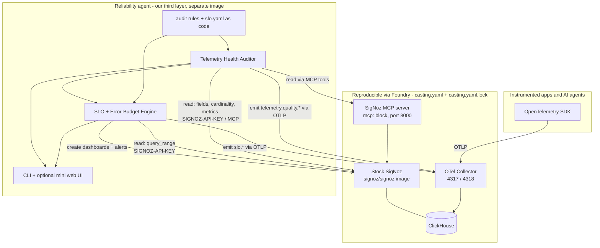
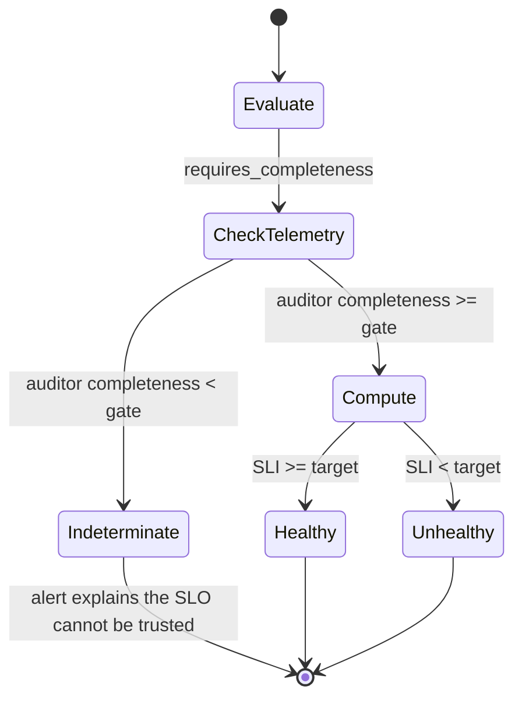
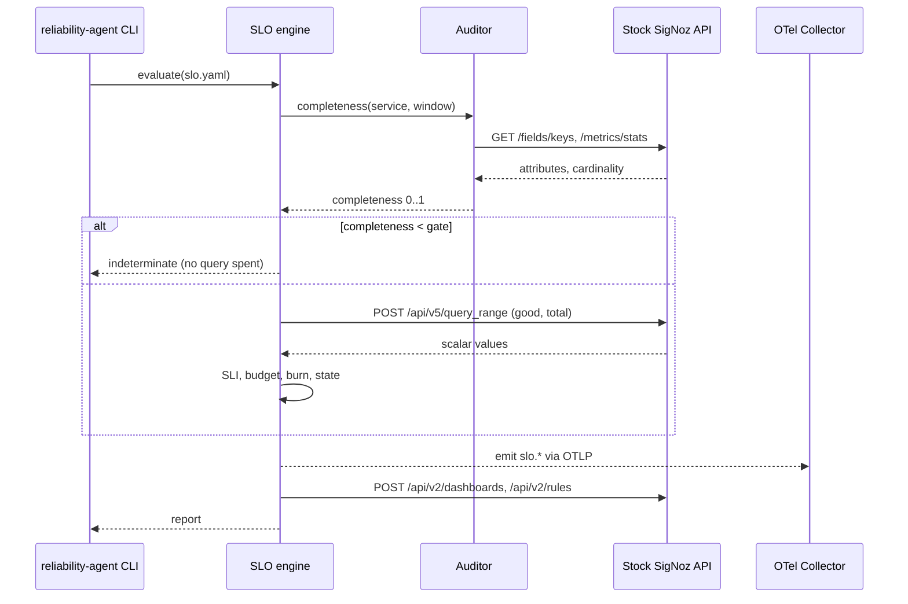

# PRD: SigNoz Reliability & Telemetry Auditor (third-layer)

Status: Draft (design only)
Owner: NarayanaSabari
Target: `guruvedhanth-s/signoz` fork (hackathon)
Repo base for file links: `https://github.com/guruvedhanth-s/signoz/blob/main`

> Architecture note (v2): this PRD supersedes the earlier "inbuilt module" design.
> The project is now a **third layer** that runs beside a **stock, unmodified SigNoz**
> and integrates only through public interfaces (REST API, MCP server, OTLP).
> See section 2 for why this change was made.

---

## 1. Executive summary

This project adds an AI-assisted reliability layer on top of SigNoz.

SigNoz already provides OpenTelemetry ingestion, logs, metrics, traces, dashboards, alerts, and an MCP server for agent access.
This project does not rebuild any of that.
It answers two higher-level questions that SigNoz does not answer on its own:

1. Can we trust the telemetry being ingested into SigNoz?
2. Is the monitored service or AI agent meeting its reliability objectives?

The solution is a single standalone service (the "reliability agent") that combines two engines:

- Telemetry Health Auditor: inspects SigNoz data for completeness, correctness, cost, and queryability, and produces a deterministic health score with actionable findings.
- SLO and Error-Budget Engine: reads SLO definitions as code, computes SLIs, error budgets, and multi-window burn rates, and gates the result on telemetry trust via an `indeterminate` state.

Both engines read from SigNoz over its public API and MCP server, and write their results back into SigNoz as metrics, dashboards, and alerts.
Nothing in the SigNoz deployment is modified, so the whole stack stays reproducible by Foundry.

The closed loop:

```text
instrument -> ingest into stock SigNoz -> audit telemetry quality ->
calculate SLOs -> gate on trust (indeterminate) -> emit score + SLO metrics ->
generate dashboards + burn-rate alerts -> recommend remediation -> verify improvement
```

---

## 2. Why a third layer (and why not modify SigNoz)

The hackathon requires installing SigNoz with Foundry and making the deployment reproducible: the repo must ship `casting.yaml` and `casting.yaml.lock`, and judges re-run Foundry to reproduce the stack.

That model assumes a **stock** SigNoz.
An earlier version of this project modified SigNoz source (a Go module plus a React page).
That approach is wrong for this hackathon for two reasons:

1. Use SigNoz as-is.
   Judges install stock SigNoz; a source fork would require publishing a custom SigNoz image and pointing `casting.yaml` at it, which fights the "reproducible stock deployment" rule and forces a re-fork on every upstream release.
2. Clean integration surface exists.
   Stock SigNoz already exposes everything this project needs through its public API, MCP server, and OTLP ingestion (see section 4). There is no need to touch core.

Decision: build an independent service that runs beside a stock, Foundry-installed SigNoz and integrates only through public interfaces.

---

## 3. Goals and non-goals

### Goals

1. A deterministic, reproducible telemetry health score per service and per signal.
2. At least 5 quality checks run against real SigNoz data via its public API and MCP tools.
3. SLO definitions as typed code, with SLI, error budget, and multi-window burn rate.
4. The `healthy` / `unhealthy` / `indeterminate` trust state, gated by the auditor.
5. Results written back into SigNoz as metrics, generated dashboards, and burn-rate alerts, using only public endpoints.
6. LLM used only to phrase developer feedback, never to compute a score.
7. The SigNoz deployment stays stock and reproducible by Foundry.
8. The entire deliverable is a single Go service. The user interface is the Go CLI plus the dashboards it generates inside SigNoz; there is no separate frontend.

### Non-goals

1. Modifying SigNoz source, or shipping a custom SigNoz image.
2. Modifying the Foundry-generated deployment (`pours/`, compose files) to enable features. Everything must work on the stock deployment exactly as `foundryctl cast` produces it.
3. Any frontend, JavaScript, or React code. The deliverable is Go only.
4. Rebuilding ingestion, storage, dashboards, alerting, or LLM tracing that SigNoz already provides.
5. Destructive remediation without explicit human approval.
6. Depending on SigNoz Cloud only features. The service must work against self-hosted SigNoz.

---

## 4. SigNoz integration surface (researched, stock endpoints)

The service integrates through three channels, all available on stock SigNoz. No source changes.

### 4.1 Authentication (machine-to-machine)

- Create a service account (Settings -> Service Accounts, admin role) and an API key.
- Send the header `SIGNOZ-API-KEY: <key>` on every REST call.
- The same key authenticates the MCP server (with `X-SigNoz-URL: <instance-url>`).

### 4.2 Read (query telemetry)

| Purpose | REST endpoint | MCP tool |
|---|---|---|
| Run PromQL / builder / ClickHouse queries (SLIs) | `POST /api/v5/query_range` | `execute_builder_query`, `query_metrics` |
| List attribute keys (missing-attribute checks) | `GET /api/v1/fields/keys` | `get_field_keys` |
| List attribute values | `GET /api/v1/fields/values` | `get_field_values` |
| Metric names / metadata / temporality | `GET /api/v2/metrics`, `/api/v2/metrics/metadata` | `list_metrics` |
| Metric cardinality / usage | `POST /api/v2/metrics/stats` | `check_metric_cardinality`, `check_metric_usage` |

`POST /api/v5/query_range` is validated end to end in the current prototype.

### 4.3 Write-back (create artifacts)

| Purpose | REST endpoint | MCP tool |
|---|---|---|
| Create / update dashboards | `POST` / `PUT /api/v2/dashboards` | `create_dashboard`, `update_dashboard` |
| Create burn-rate alerts | `POST /api/v2/rules` | `create_alert` |

Dashboard payload is a plain JSON object (`map[string]interface{}`), so a dashboard can be assembled directly by the service.

### 4.4 Emit metrics back

- Send `slo.*` and `telemetry.quality.*` metrics to the OTel collector over OTLP (gRPC 4317 or HTTP 4318). No auth header.
- Custom metrics flow to ClickHouse and become queryable through `POST /api/v5/query_range`, so generated dashboards can chart them.
- This path is validated in the current prototype (the seeder).

### 4.5 MCP server

- The SigNoz MCP server is a standalone service deployable by Foundry via an `mcp:` block in `casting.yaml` (port 8000, `/mcp`).
- It exposes ~40 `signoz_` tools; the ones this project uses map almost 1:1 onto the auditor and generator needs (see the tables above).
- Recommended posture: REST is the reliable spine for the demo; MCP is a thin optional path used for the "agent investigates in natural language" moment, so a flaky or Cloud-only MCP never blocks the live demo.

---

## 5. Scope

The team is four people, so the build runs as two parallel tracks that meet at the `indeterminate` coupling.
Both ship in the hackathon.

### Track A: Telemetry Health Auditor (in scope)

- 5 checks: `missing_service_name`, `missing_model_name`, `missing_token_usage`, `high_cardinality_attribute`, `stale_service`.
- Deterministic weighted score, emitted back as `telemetry.quality.*` metrics.
- Findings report (CLI and JSON), each with severity, affected signal, count, recommendation, and a SigNoz deep link.

### Track B: SLO and Error-Budget Engine (in scope)

- SLO definitions as typed YAML.
- SLI types: ratio (shipping), latency threshold, completeness, grounded answers.
- Compliance, error budget, multi-window multi-burn-rate (MWMB).
- The `healthy` / `unhealthy` / `indeterminate` state machine, gated by the auditor.
- `slo.*` metrics emitted over OTLP; generated SLO dashboard and burn-rate alerts, created idempotently via the API.

### Stretch

- LLM feedback layer generating prose and SDK snippets per finding.
- More auditor checks (trace parent-child integrity, counter/gauge misuse, missing severity, trace-log correlation).
- Remediation delivered as a pull request rather than a copyable patch.

### Explicitly out of scope

- Any modification to SigNoz source or its container image.

---

## 6. Architecture

### 6.1 System context



Nothing inside the `foundry` box is modified.
The reliability agent is a separate container that authenticates with an API key.

### 6.2 The trust state machine (the differentiator)



```text
healthy       = telemetry is complete AND SLI >= target
unhealthy     = telemetry is complete AND SLI <  target
indeterminate = telemetry is incomplete, so the SLO cannot be trusted
```

### 6.3 Request and scoring flow



---

## 7. Telemetry Health Auditor: check catalog (MVP)

Each check is backed by a stock SigNoz read endpoint or MCP tool. No new queries against ClickHouse directly.

| Check id | Severity | Detects | Backing endpoint / tool |
|---|---|---|---|
| `missing_service_name` | critical | spans/metrics without `service.name` | `get_field_keys` / `/api/v1/fields/keys` |
| `missing_model_name` | critical | LLM spans without `gen_ai.request.model` | `get_field_keys` |
| `missing_token_usage` | warning | LLM spans without token attributes | `get_field_keys` |
| `high_cardinality_attribute` | warning | attributes above a cardinality threshold | `check_metric_cardinality` / `/api/v2/metrics/stats` |
| `stale_service` | warning | services with no recent data | `list_metrics` + `query_metrics` (last-seen) |

Phase 2 candidates: `counter_gauge_misuse` (`/api/v2/metrics/metadata`), `unmapped_llm_model`, `broken_trace_context` (`search_traces`).

---

## 8. Deterministic health score

The score is reproducible: identical telemetry in produces an identical score out.
The LLM never touches this computation.

```text
score = clamp(100 - 15*count(critical) - 5*count(warning) - 1*count(info), 0, 100)
```

Finding shape:

```json
{
  "rule": "missing_service_name",
  "severity": "critical",
  "affected_signal": "traces",
  "affected_count": 18,
  "signoz_link": "https://<host>/traces-explorer?...",
  "recommendation": "Set service.name in the OpenTelemetry Resource."
}
```

### 8.1 Per-check status (distinct from SLO state)

Each check returns exactly one status:

- `pass`: complete evidence was evaluated and the pass condition held;
- `fail`: complete evidence was evaluated and the pass condition did not hold;
- `indeterminate`: required evidence was unavailable, partial, stale beyond the threshold, or invalid.

An empty result page, an API error, a partial or truncated response, an unknown metric, or incomplete pagination must never be counted as a `pass`.
Audit `indeterminate` is a telemetry-evidence state; it is not an SLO state.
The score subtracts only `fail` results by severity, so an `indeterminate` check neither passes nor silently lowers the score.

### 8.2 The auditor and the SLO engine are separate

Mandatory boundary: the audit output must never contain an SLO verdict.
It must not include `slo_status`, `slo_compliance`, `error_budget_remaining`, `burn_rate`, or any per-SLO impact.
The auditor answers "can this telemetry be trusted?"; the SLO engine answers "given trusted telemetry, is the target met?".
The only thing that crosses the boundary is the completeness-gate result (section 9.6), and it flows auditor to SLO engine, never the reverse.

---

## 9. SLO and Error-Budget Engine

### 9.1 SLO-as-code

```yaml
service: support-agent
environment: local
slos:
  - name: successful-agent-runs
    type: ratio
    target: 99          # 99 or 0.99 both accepted
    window: 30d
    good_query: agent_success_total     # single-vector PromQL
    total_query: agent_requests_total
    requires_completeness: true         # gate on the auditor
```

### 9.2 SLI computation

| Type | SLI | How |
|---|---|---|
| `ratio` | good / total | two windowed scalar queries |
| `latency_threshold` | under-threshold / total | windowed histogram bucket and count |
| `completeness` | complete runs / total | windowed good/total over a completeness marker |
| `grounded_answers` | grounded / total | windowed good/total over a grounded-verdict count |

### 9.3 Query correctness (mandatory)

Every SLO query must:

- scope to the requested `service` and `environment` (for example `{service_name="support-agent"}`);
- evaluate over the configured window, not an instant;
- use `increase(...)` or `rate(...)` for cumulative counters, never the latest raw counter value;
- use windowed histogram bucket and count expressions for latency, never raw cumulative buckets;
- distinguish a real zero, no data, partial data, and query failure;
- treat a zero denominator as `indeterminate` unless an explicit no-traffic policy is set;
- treat missing, stale, partial, or failed evidence as `indeterminate`, never as a pass or a healthy result;
- validate the target as a fraction in `(0, 1]`, and handle a 100% target (zero allowed budget) explicitly;
- return the evaluated start and end timestamps and preserve SigNoz query-completeness metadata.

A raw value read is correct only for a gauge. For a cumulative counter the SLI numerator and denominator are `sum(increase(metric{service_name="..."}[window]))`.

### 9.4 Error budget and burn rate

```text
error_budget           = (1 - target) * total
error_budget_remaining = 1 - (error_rate / (1 - target))   # over the window
burn_rate              = error_rate / (1 - target)          # 1.0 exhausts by end of window
```

### 9.5 Multi-window multi-burn-rate alerting

Google SRE style: a tier fires only when the burn rate exceeds its threshold over both a long and a short window.

| Alert | Long | Short | Burn threshold | Severity |
|---|---|---|---|---|
| Fast | 1h | 5m | 14.4x | page |
| Medium | 6h | 30m | 6x | ticket |
| Slow | 24h | 2h | 3x | ticket |

Implementation: the agent computes the burn rate for each window itself and emits it as a labelled metric (`slo_burn_rate{window="1h"}`, `{window="5m"}`, `{window="6h"}`, and so on).
Each tier is a SigNoz threshold alert whose condition requires both the long-window and the short-window series to exceed the threshold (a two-query rule with an AND join, or two coordinated rules).
Precomputing the burn rate as a plain metric and alerting on a threshold avoids the upstream formula-alert bugs ([#10823](https://github.com/SigNoz/signoz/issues/10823), [#10881](https://github.com/SigNoz/signoz/issues/10881)).
The MVP may ship the fast tier first; the full three-tier ladder is required for completeness.

### 9.6 Completeness gate

The gate is the only interface from the SLO engine to the auditor, and it is service-, environment-, and window-scoped:

```go
type CompletenessGate interface {
    Check(ctx context.Context, service, environment string, window time.Duration) (GateResult, error)
}

type GateResult struct {
    Coverage      float64 // 0..1 fraction of required evidence present
    QueryComplete bool    // SigNoz reported the query as complete
    Trusted       bool    // Coverage >= threshold AND QueryComplete
    Reason        string  // why the evidence is not trusted, when applicable
}
```

When `Trusted` is false and the SLO requires completeness, the SLO resolves to `indeterminate` before any SLI query is spent.
The gate must use the service and environment so one service cannot satisfy another's gate.
SLO state never flows back into the gate.

### 9.7 Metric contract

The producer and the SLO config must agree on one canonical metric contract.
Names are normalized to PromQL-safe form (dots become underscores): `agent_requests_total`, `agent_success_total`, `agent_errors_total`, and a latency histogram such as `gen_ai_server_request_duration`.
Counters are cumulative and queried with `increase(...)`; the latency metric is a histogram queried with windowed bucket and count expressions.
Every metric carries `service.name` (and `deployment.environment` when present) so queries can be scoped.

---

## 10. Emitted metrics schema (via OTLP)

| Metric | Type | Labels |
|---|---|---|
| `telemetry_quality_score` | gauge | `service` |
| `telemetry_quality_findings` | gauge | `service`, `severity` |
| `telemetry_quality_coverage` | gauge | `service` |
| `slo_compliance` | gauge | `service`, `slo`, `window` |
| `slo_state` | gauge (0 unhealthy, 1 healthy, 2 indeterminate) | `service`, `slo` |
| `slo_error_budget_remaining` | gauge | `service`, `slo` |
| `slo_burn_rate` | gauge | `service`, `slo`, `window` |

Instrument names use underscores so the metrics are directly queryable in PromQL; OTLP dotted names are kept as-is in ClickHouse and are not PromQL-queryable.
Emitted over OTLP to the collector, so they land in ClickHouse and chart on generated dashboards.

---

## 11. Generated dashboards and alerts

- The engine assembles an SLO dashboard (PromQL panels for `slo_compliance`, `slo_error_budget_remaining`, `slo_burn_rate`, `slo_state`) and creates or updates it via the SigNoz dashboard API (or MCP `create_dashboard`).
- Dashboard API version: use the API that renders on the **stock** deployment, verified against the UI. Do not modify `pours/` or compose to enable a dashboard version. If the stock UI renders the classic (v1) format, use v1; only use v2 if stock requires it.
- Creation is idempotent, keyed by a stable dashboard title, so re-running never duplicates.
- A notification channel is ensured (idempotent) because SigNoz rules require at least one channel.
- Burn-rate alerts are created via `POST /api/v2/rules` (or MCP `create_alert`) as simple threshold rules over `slo_burn_rate`, one per tier (section 9.5).

---

## 12. LLM feedback layer (stretch, bounded)

- Input: a structured finding. Output: a friendly explanation plus a suggested SDK snippet.
- It never returns or alters the numeric score, and the service works fully without it.
- This mirrors how SigNoz separates its deterministic query engine from the Noz AI layer.

---

## 13. Standalone service design

A single Go service, `reliability-agent`, packaged as its own container.

```text
reliability-agent/
  cmd/agent/            entrypoint: `audit`, `slo`, `generate` subcommands
  internal/signozclient/  REST + MCP client (SIGNOZ-API-KEY), query_range, fields, dashboards, rules
  internal/otlp/          OTLP metric exporter (telemetry.quality.*, slo.*)
  internal/audit/         check registry + deterministic score
  internal/slo/           config, SLI evaluators, budget/burn, state machine, generator
  internal/config/        typed YAML loaders
  Dockerfile
  slo.yaml, audit.yaml    example configs
```

The interface seam between Track A and Track B is the single `CompletenessGate` from section 9.6: the SLO engine calls the auditor for a service, environment, and window, receives a `GateResult`, and short-circuits to `indeterminate` when the evidence is not trusted. The auditor never learns SLO names or SLO state.

---

## 14. Deployment and Foundry reproducibility

- `casting.yaml` installs stock SigNoz + collector + the MCP server (`mcp:` block). Standard, no custom image.
- `casting.yaml.lock` is generated once by running `foundryctl cast` and committed to the repo.
- The reliability agent ships its own `Dockerfile` and a compose snippet (or documented `docker run`) that points at the Foundry-installed SigNoz via `SIGNOZ_URL` and `SIGNOZ_API_KEY`.
- Judges reproduce the SigNoz deployment with `foundryctl cast -f casting.yaml`, then run the agent container against it.

Suggested repo shape:

```text
/                             fork of SigNoz, UNMODIFIED (reference + Foundry target)
casting.yaml, casting.yaml.lock   stock SigNoz + MCP, reproducible
reliability-agent/            the third-layer service (our code)
hackathon/seed/               deterministic OTLP telemetry seeder (reused)
hackathon/DEMO.md             runbook
```

---

## 15. What we reuse from the prototype

The prototype built the SLO logic as an in-tree module.
Because the SLI evaluation was written behind a `ScalarQuerier` seam, the pure logic ports to the standalone service with only the transport swapped from in-process calls to HTTP.

| Component | Ports to third layer |
|---|---|
| SLO types, config, YAML parsing | as-is |
| error budget, burn-rate, MWMB math | as-is |
| the `indeterminate` state machine | as-is |
| ratio SLI evaluator | unchanged (new `ScalarQuerier` HTTP impl) |
| dashboard JSON builder | as-is |
| all unit tests | as-is |
| OTLP seeder | reused as-is |

Transport pieces to rewrite: query client (HTTP `query_range`), OTLP emitter (direct exporter), dashboard/alert client (HTTP), CLI. The in-SigNoz React page is dropped; the primary UI becomes the generated SigNoz dashboard plus the agent CLI.

---

## 16. Test plan

- Unit test every check and SLI/budget/burn function (pure, table-driven).
- Unit test the state machine, including that a failing completeness gate forces `indeterminate` even when the raw SLI would pass.
- Contract test the SigNoz client against recorded responses.
- Integration test against a live Foundry-installed SigNoz with the deterministic seeder: assert the SLO flips indeterminate -> healthy -> unhealthy and that generation is idempotent.

---

## 17. Demo script (7 minutes)

```text
1. foundryctl cast -f casting.yaml   -> stock SigNoz + MCP come up.
2. Run the agent: `reliability-agent audit`. Show telemetry health score ~48 with findings.
3. Run `reliability-agent slo`. successful-agent-runs is INDETERMINATE (no trustworthy data).
4. Seed healthy telemetry. Re-run: score climbs, SLO flips to HEALTHY (sli 0.995, budget 50%, burn 0.5x).
5. Run `reliability-agent generate`. Show the generated SLO dashboard inside SigNoz.
6. Seed failing telemetry. SLO flips to UNHEALTHY, burn 20x, fast-burn alert fires.
7. Pitch: our layer verifies SigNoz's telemetry is trustworthy, then measures reliability against it.
```

---

## 18. Judging criteria mapping

| Criterion | How this project scores |
|---|---|
| Potential Impact | prevents teams trusting dashboards and SLOs built on incomplete telemetry |
| Creativity | the `indeterminate` trust state; auditing the trustworthiness of the data itself |
| Technical Excellence | deterministic scoring, typed config, bounded queries, unit + integration tests, idempotent generation |
| Best Use of SigNoz | reads via query API + fields + cardinality, writes dashboards + alerts, emits metrics via OTLP, uses the MCP server |
| User Experience | one CLI, a clear score, actionable findings with SigNoz deep links, plus generated dashboards |
| Presentation | reproducible Foundry deployment; deterministic before/after demo |
| Reproducibility | stock SigNoz via `casting.yaml` + `casting.yaml.lock`; agent runs as a separate container |

---

## 19. Risks and mitigations

| Risk | Mitigation |
|---|---|
| MCP is Cloud-only or flaky in the demo | REST is the reliable spine; MCP is an optional path. The agent runs fully on self-hosted REST. |
| Programmatic alert bugs (`#10823`, `#10881`) | precompute burn rate as a metric; alert with a simple threshold, not a formula |
| Emitted metrics not queryable | emit via OTLP to the collector (validated), not an in-process meter |
| Two tracks diverging across four people | the only seam is the `CompletenessGate`; freeze it first |
| Generation duplicates on re-run | idempotent, keyed by stable dashboard/alert names |

---

## 20. Open questions

1. MCP-first or REST-first for the read path in the demo (recommendation: REST spine, MCP optional).
2. Which LLM provider for the Phase 2 feedback prose, and is a key available in the demo environment.
3. Standalone mini web UI for the health score, or CLI plus generated dashboards only.
