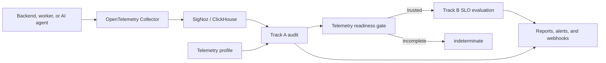

# SRE Sidekick Reliability Agent

The Reliability Agent audits whether an application's telemetry is trustworthy
and then evaluates reliability objectives using that trusted telemetry.

It separates two questions that are commonly mixed together:

1. **Track A — Telemetry quality:** Are the logs, traces, and metrics complete,
   fresh, correctly structured, and safe to use?
2. **Track B — Service reliability:** Does the service meet its SLO, and what is
   its remaining error budget and burn rate?

Track A never decides whether an application SLO passed. It only determines
whether the available telemetry is reliable enough to support that decision.
When evidence is unavailable or incomplete, the agent returns
`indeterminate` rather than inventing a healthy or unhealthy result.

## How it works



Each service supplies its own telemetry profile and SLO configuration. This
allows a normal backend, AI agent, worker, or custom application to use
different fields and rules without receiving irrelevant findings.

## Track A: telemetry quality

Track A checks the quality of observability data, not application health.

Examples of Track A problems:

- logs are missing `trace_id`;
- `service.name` is missing;
- expected spans do not exist;
- logs or metrics stopped arriving;
- an attribute has unbounded cardinality;
- a SigNoz query is incomplete or unavailable.

Supported rule types:

- `required_field`
- `required_span`
- `freshness`
- `cardinality`

Findings have `blocker`, `warning`, or `info` severity and one of these states:

- `pass`
- `fail`
- `indeterminate`
- `not_applicable`

Track A produces a report containing findings, affected counts, coverage,
quality score, recommendations, and overall status.

### Service profiles

Profiles are YAML telemetry contracts. Examples are available in:

- `examples/checkout-api.yaml`
- `examples/support-agent.yaml`
- `examples/log-demo-backend.yaml`

A profile declares the service, environment, source, expected fields, and
service-specific rules:

```yaml
apiVersion: reliability/v1
kind: TelemetryProfile

metadata:
  name: log-demo-backend
  service: log-demo-backend
  environment: demo

spec:
  data_kind: backend
  source:
    adapter: signoz
    endpoint: http://localhost:8080

  signals:
    logs:
      fields:
        - path: body
          type: string
          required: true
        - path: trace_id
          type: string
          required: true

  audit_rules:
    - id: log-trace-correlation
      type: required_field
      signal: logs
      field: trace_id
      severity: blocker
      recommendation: Attach the active trace ID to every application log.
```

Supported `data_kind` values are `backend`, `ai_agent`, `worker`, and `custom`.

## Track B: SLO evaluation

Track B queries SigNoz using service- and environment-scoped PromQL. It
supports:

- success or quality ratios;
- latency-threshold SLIs;
- telemetry-completeness SLIs;
- grounded-answer SLIs for AI agents;
- target comparison;
- remaining error-budget calculation;
- burn-rate calculation;
- `healthy`, `unhealthy`, and `indeterminate` states.

SLOs are configured separately from telemetry audit rules:

```yaml
version: "1"
service: checkout-api
environment: test

slos:
  - name: request-success
    type: ratio
    target: 0.995
    window: 30d
    requires_completeness: true
    completeness_threshold: 0.95
    good_query: increase(http_server_request_success_total{service_name="checkout-api",environment="test"}[30d])
    total_query: increase(http_server_request_total{service_name="checkout-api",environment="test"}[30d])
    dependencies:
      - http_server_request_success_total
      - http_server_request_total
```

Ratio, completeness, and grounded-answer queries must use `rate()` or
`increase()` over the exact configured SLO window. This prevents cumulative
counters or a mismatched short range from silently producing an incorrect SLI.
Generated latency queries automatically include the configured service,
environment, and any selectors already present on the histogram metric.

Examples:

- `examples/checkout-slo.yaml`
- `examples/support-agent-slo.yaml`

If required metrics are missing, partial, unauthorized, or unavailable, Track B
returns `indeterminate` instead of treating missing data as zero.

## Prerequisites

- Go
- a running SigNoz backend, normally `http://localhost:8080`;
- an OpenTelemetry Collector accepting logs on
  `http://localhost:4318/v1/logs`;
- a SigNoz service-account API key with the built-in Viewer role.

Export the local connection details:

```bash
export SIGNOZ_URL='http://localhost:8080'
export SIGNOZ_API_KEY='YOUR_SERVICE_ACCOUNT_KEY'
```

Do not commit the API key.

## Verified live logs demo

The repository includes a standalone backend used to demonstrate Track A. The
backend always remains application-healthy, but its fault endpoint deliberately
emits malformed logs without a trace ID.

### 1. Start the demo backend

```bash
go run ./cmd/log-demo-backend
```

Defaults:

- application URL: `http://localhost:8090`;
- OTLP logs endpoint: `http://localhost:4318/v1/logs`;
- `service.name`: `log-demo-backend`;
- environment: `demo`;
- log heartbeat: every two seconds.

Verify application health:

```bash
curl -fsS http://localhost:8090/healthz | python3 -m json.tool
```

Expected:

```json
{
  "application_healthy": true,
  "status": "ok",
  "telemetry_mode": "healthy"
}
```

### 2. Start automatic Track A auditing

In another terminal:

```bash
go run ./cmd/reliability-agent audit-watch \
  --profile examples/log-demo-backend.yaml \
  --interval 2s \
  --lookback 15s
```

The watcher:

1. queries recent logs through SigNoz `/api/v5/query_range`;
2. normalizes the response into Track A evidence;
3. applies the profile's log rules;
4. prints an audit report every cycle;
5. opens one alert after two consecutive blocker failures;
6. suppresses duplicate alerts;
7. emits one recovery event after the audit recovers.

Warnings remain visible but do not page by default. The alert policy can be
changed with:

```text
--alert-severity warning
--failures-before-alert 1
```

### 3. Inject unhealthy telemetry

```bash
curl -fsS -X POST http://localhost:8090/demo/unhealthy \
  | python3 -m json.tool
```

This changes only telemetry emission. `/healthz` continues returning 200 while
new logs omit `trace_id`.

After two failed audits, the watcher emits one event similar to:

```json
{
  "kind": "track_a_alert",
  "state": "firing",
  "service": "log-demo-backend",
  "current_status": "fail",
  "message": "telemetry quality audit failed"
}
```

The `log-trace-correlation` finding contains the number of affected records.
Repeated failed audits do not emit duplicate firing events.

### 4. Recover telemetry

```bash
curl -fsS -X POST http://localhost:8090/demo/healthy \
  | python3 -m json.tool
```

Malformed logs must leave the configured lookback window before the audit can
pass:

```bash
sleep 20
```

The watcher then emits one event with `"state":"resolved"`.

### Webhook delivery

Console alerts can also be delivered to an HTTP endpoint:

```bash
go run ./cmd/reliability-agent audit-watch \
  --profile examples/log-demo-backend.yaml \
  --interval 2s \
  --lookback 15s \
  --webhook-url http://localhost:9000/alerts
```

The webhook receives the same firing and resolved JSON documents printed by the
watcher.

## Run an SLO evaluation

```bash
go run ./cmd/reliability-agent slo \
  --config examples/checkout-slo.yaml \
  --output json
```

The command uses the SigNoz v5 query API and the service-account key from the
environment.

## Run the HTTP server

```bash
go run ./cmd/reliability-agent \
  --listen 127.0.0.1:8081 \
  --profile examples/checkout-api.yaml
```

The server binds to loopback by default. To expose it on a routable interface,
configure a bearer token and send it in the `Authorization` header:

```bash
export RELIABILITY_AGENT_API_KEY='replace-with-a-secret'
go run ./cmd/reliability-agent --listen 0.0.0.0:8081
curl -H "Authorization: Bearer ${RELIABILITY_AGENT_API_KEY}" \
  http://127.0.0.1:8081/v1/profiles
```

`GET /healthz` remains unauthenticated for health probes. All JSON request
bodies are limited to 1 MiB by default.

Available endpoints:

```text
GET  /healthz
GET  /v1/profiles
GET  /v1/profiles/{name}
POST /v1/profiles
POST /v1/profiles/{name}/validate
POST /v1/profiles/{name}/activate
POST /v1/audit
POST /v1/slo/evaluate
```

`POST /v1/audit` accepts a normalized evidence snapshot and runs the selected
profile. `POST /v1/slo/evaluate` accepts an SLO configuration and performs live
SigNoz scalar queries.

Profiles registered through the API are currently held in memory and are lost
when the process restarts.

## Development

Format and test:

```bash
make fmt
make test
```

Or run directly:

```bash
go test ./...
go vet ./...
```

Convenience targets:

```bash
make run
make run-log-demo
make watch-logs
```

## Project structure

```text
cmd/reliability-agent       Main server, audit-watch, and SLO CLI
cmd/log-demo-backend        Always-healthy OTLP logs demo service
examples                    Telemetry profiles and SLO configurations
internal/profile            Profile model and validation
internal/evidence           Source-neutral telemetry snapshot
internal/source             Telemetry source interface
internal/source/signoz      SigNoz query and normalization adapters
internal/audit              Track A rule engine and scoring
internal/monitor            Scheduled auditing and alert transitions
internal/alerting           JSON and webhook alert delivery
internal/slo                Track B SLI, SLO, budget, and burn-rate engine
internal/api                HTTP API
internal/registry           In-memory profile registry
```

## Current implementation status

Implemented:

- profile-driven telemetry contracts;
- backend, worker, AI-agent, and custom data kinds;
- Track A rule evaluation and scoring;
- live SigNoz log querying and normalization;
- scheduled log audits;
- blocker debounce, duplicate suppression, and recovery alerts;
- console and webhook alert delivery;
- live SigNoz SLO queries;
- SLI, target, error-budget, and burn-rate calculations;
- safe `indeterminate` handling;
- unit and end-to-end demo coverage.

Not yet implemented:

- live Track A trace and metric snapshot planners;
- persistent profile, report, and alert storage;
- automatic profile-to-PromQL planning for Track B;
- native SigNoz Alertmanager notification integration;
- dashboards for Track A reports and SLO results;
- distributed scheduler coordination for multiple agent replicas.

The current logs demo is fully functional. Other Track A signals can be tested
by supplying normalized evidence to `POST /v1/audit` until their live source
planners are added.
